# postgres

## Tables

| Name                                                                                              | Columns | Comment | Type       |
| ------------------------------------------------------------------------------------------------- | ------- | ------- | ---------- |
| [atlas_schema_revisions.atlas_schema_revisions](atlas_schema_revisions.atlas_schema_revisions.md) | 12      |         | BASE TABLE |
| [public.codebases](public.codebases.md)                                                           | 11      |         | BASE TABLE |
| [public.analyses](public.analyses.md)                                                             | 13      |         | BASE TABLE |
| [public.test_suites](public.test_suites.md)                                                       | 6       |         | BASE TABLE |
| [public.test_cases](public.test_cases.md)                                                         | 7       |         | BASE TABLE |
| [public.users](public.users.md)                                                                   | 8       |         | BASE TABLE |
| [public.oauth_accounts](public.oauth_accounts.md)                                                 | 9       |         | BASE TABLE |
| [public.user_bookmarks](public.user_bookmarks.md)                                                 | 4       |         | BASE TABLE |
| [public.user_analysis_history](public.user_analysis_history.md)                                   | 5       |         | BASE TABLE |
| [public.github_organizations](public.github_organizations.md)                                     | 8       |         | BASE TABLE |
| [public.user_github_org_memberships](public.user_github_org_memberships.md)                       | 6       |         | BASE TABLE |
| [public.user_github_repositories](public.user_github_repositories.md)                             | 20      |         | BASE TABLE |
| [public.github_app_installations](public.github_app_installations.md)                             | 10      |         | BASE TABLE |
| [public.refresh_tokens](public.refresh_tokens.md)                                                 | 8       |         | BASE TABLE |
| [public.test_files](public.test_files.md)                                                         | 5       |         | BASE TABLE |
| [public.system_config](public.system_config.md)                                                   | 3       |         | BASE TABLE |
| [public.spec_documents](public.spec_documents.md)                                                 | 8       |         | BASE TABLE |
| [public.spec_domains](public.spec_domains.md)                                                     | 8       |         | BASE TABLE |
| [public.spec_features](public.spec_features.md)                                                   | 7       |         | BASE TABLE |
| [public.spec_behaviors](public.spec_behaviors.md)                                                 | 7       |         | BASE TABLE |
| [public.user_specview_history](public.user_specview_history.md)                                   | 5       |         | BASE TABLE |
| [public.usage_events](public.usage_events.md)                                                     | 7       |         | BASE TABLE |
| [public.subscription_plans](public.subscription_plans.md)                                         | 7       |         | BASE TABLE |
| [public.user_subscriptions](public.user_subscriptions.md)                                         | 9       |         | BASE TABLE |

## Enums

| Name                       | Values                                                                             |
| -------------------------- | ---------------------------------------------------------------------------------- |
| public.analysis_status     | completed, failed, pending, running                                                |
| public.github_account_type | organization, user                                                                 |
| public.oauth_provider      | github                                                                             |
| public.plan_tier           | enterprise, free, pro, pro_plus                                                    |
| public.river_job_state     | available, cancelled, completed, discarded, pending, retryable, running, scheduled |
| public.subscription_status | active, canceled, expired                                                          |
| public.test_status         | active, focused, skipped, todo, xfail                                              |
| public.usage_event_type    | analysis, specview                                                                 |

## Relations

```mermaid
erDiagram

"public.analyses" }o--|| "public.codebases" : "FOREIGN KEY (codebase_id) REFERENCES codebases(id) ON DELETE CASCADE"
"public.test_suites" }o--o| "public.test_suites" : "FOREIGN KEY (parent_id) REFERENCES test_suites(id) ON DELETE CASCADE"
"public.test_suites" }o--|| "public.test_files" : "FOREIGN KEY (file_id) REFERENCES test_files(id) ON DELETE CASCADE"
"public.test_cases" }o--|| "public.test_suites" : "FOREIGN KEY (suite_id) REFERENCES test_suites(id) ON DELETE CASCADE"
"public.oauth_accounts" }o--|| "public.users" : "FOREIGN KEY (user_id) REFERENCES users(id) ON DELETE CASCADE"
"public.user_bookmarks" }o--|| "public.codebases" : "FOREIGN KEY (codebase_id) REFERENCES codebases(id) ON DELETE CASCADE"
"public.user_bookmarks" }o--|| "public.users" : "FOREIGN KEY (user_id) REFERENCES users(id) ON DELETE CASCADE"
"public.user_analysis_history" }o--|| "public.analyses" : "FOREIGN KEY (analysis_id) REFERENCES analyses(id) ON DELETE CASCADE"
"public.user_analysis_history" }o--|| "public.users" : "FOREIGN KEY (user_id) REFERENCES users(id) ON DELETE CASCADE"
"public.user_github_org_memberships" }o--|| "public.users" : "FOREIGN KEY (user_id) REFERENCES users(id) ON DELETE CASCADE"
"public.user_github_org_memberships" }o--|| "public.github_organizations" : "FOREIGN KEY (org_id) REFERENCES github_organizations(id) ON DELETE CASCADE"
"public.user_github_repositories" }o--|| "public.users" : "FOREIGN KEY (user_id) REFERENCES users(id) ON DELETE CASCADE"
"public.user_github_repositories" }o--o| "public.github_organizations" : "FOREIGN KEY (org_id) REFERENCES github_organizations(id) ON DELETE CASCADE"
"public.github_app_installations" }o--o| "public.users" : "FOREIGN KEY (installer_user_id) REFERENCES users(id) ON DELETE SET NULL"
"public.refresh_tokens" }o--|| "public.users" : "FOREIGN KEY (user_id) REFERENCES users(id) ON DELETE CASCADE"
"public.refresh_tokens" }o--o| "public.refresh_tokens" : "FOREIGN KEY (replaces) REFERENCES refresh_tokens(id) ON DELETE SET NULL"
"public.test_files" }o--|| "public.analyses" : "FOREIGN KEY (analysis_id) REFERENCES analyses(id) ON DELETE CASCADE"
"public.spec_documents" }o--|| "public.analyses" : "FOREIGN KEY (analysis_id) REFERENCES analyses(id) ON DELETE CASCADE"
"public.spec_domains" }o--|| "public.spec_documents" : "FOREIGN KEY (document_id) REFERENCES spec_documents(id) ON DELETE CASCADE"
"public.spec_features" }o--|| "public.spec_domains" : "FOREIGN KEY (domain_id) REFERENCES spec_domains(id) ON DELETE CASCADE"
"public.spec_behaviors" }o--o| "public.test_cases" : "FOREIGN KEY (source_test_case_id) REFERENCES test_cases(id) ON DELETE SET NULL"
"public.spec_behaviors" }o--|| "public.spec_features" : "FOREIGN KEY (feature_id) REFERENCES spec_features(id) ON DELETE CASCADE"
"public.user_specview_history" }o--|| "public.users" : "FOREIGN KEY (user_id) REFERENCES users(id) ON DELETE CASCADE"
"public.user_specview_history" }o--|| "public.spec_documents" : "FOREIGN KEY (document_id) REFERENCES spec_documents(id) ON DELETE CASCADE"
"public.usage_events" }o--o| "public.analyses" : "FOREIGN KEY (analysis_id) REFERENCES analyses(id) ON DELETE SET NULL"
"public.usage_events" }o--|| "public.users" : "FOREIGN KEY (user_id) REFERENCES users(id) ON DELETE CASCADE"
"public.usage_events" }o--o| "public.spec_documents" : "FOREIGN KEY (document_id) REFERENCES spec_documents(id) ON DELETE SET NULL"
"public.user_subscriptions" }o--|| "public.users" : "FOREIGN KEY (user_id) REFERENCES users(id) ON DELETE CASCADE"
"public.user_subscriptions" }o--|| "public.subscription_plans" : "FOREIGN KEY (plan_id) REFERENCES subscription_plans(id) ON DELETE RESTRICT"

"atlas_schema_revisions.atlas_schema_revisions" {
  varchar version
  varchar description
  bigint type
  bigint applied
  bigint total
  timestamp_with_time_zone executed_at
  bigint execution_time
  text error
  text error_stmt
  varchar hash
  jsonb partial_hashes
  varchar operator_version
}
"public.codebases" {
  uuid id
  varchar_255_ host
  varchar_255_ owner
  varchar_255_ name
  varchar_100_ default_branch
  timestamp_with_time_zone created_at
  timestamp_with_time_zone updated_at
  timestamp_with_time_zone last_viewed_at
  varchar_64_ external_repo_id
  boolean is_stale
  boolean is_private
}
"public.analyses" {
  uuid id
  uuid codebase_id FK
  varchar_40_ commit_sha
  varchar_255_ branch_name
  analysis_status status
  text error_message
  timestamp_with_time_zone started_at
  timestamp_with_time_zone completed_at
  timestamp_with_time_zone created_at
  integer total_suites
  integer total_tests
  timestamp_with_time_zone committed_at
  varchar_100_ parser_version
}
"public.test_suites" {
  uuid id
  uuid parent_id FK
  varchar_500_ name
  integer line_number
  integer depth
  uuid file_id FK
}
"public.test_cases" {
  uuid id
  uuid suite_id FK
  varchar_2000_ name
  integer line_number
  test_status status
  jsonb tags
  varchar_50_ modifier
}
"public.users" {
  uuid id
  varchar_255_ email
  varchar_255_ username
  text avatar_url
  timestamp_with_time_zone last_login_at
  timestamp_with_time_zone created_at
  timestamp_with_time_zone updated_at
  integer token_version
}
"public.oauth_accounts" {
  uuid id
  uuid user_id FK
  oauth_provider provider
  varchar_255_ provider_user_id
  varchar_255_ provider_username
  text access_token
  varchar_500_ scope
  timestamp_with_time_zone created_at
  timestamp_with_time_zone updated_at
}
"public.user_bookmarks" {
  uuid user_id FK
  uuid codebase_id FK
  timestamp_with_time_zone created_at
  uuid id
}
"public.user_analysis_history" {
  uuid user_id FK
  uuid analysis_id FK
  timestamp_with_time_zone created_at
  timestamp_with_time_zone updated_at
  uuid id
}
"public.github_organizations" {
  uuid id
  bigint github_org_id
  varchar_255_ login
  text avatar_url
  text html_url
  text description
  timestamp_with_time_zone created_at
  timestamp_with_time_zone updated_at
}
"public.user_github_org_memberships" {
  uuid id
  uuid user_id FK
  uuid org_id FK
  varchar_50_ role
  timestamp_with_time_zone created_at
  timestamp_with_time_zone updated_at
}
"public.user_github_repositories" {
  uuid id
  uuid user_id FK
  bigint github_repo_id
  varchar_255_ name
  varchar_500_ full_name
  text html_url
  text description
  varchar_100_ default_branch
  varchar_50_ language
  varchar_20_ visibility
  boolean is_private
  boolean archived
  boolean disabled
  boolean fork
  integer stargazers_count
  timestamp_with_time_zone pushed_at
  varchar_20_ source_type
  uuid org_id FK
  timestamp_with_time_zone created_at
  timestamp_with_time_zone updated_at
}
"public.github_app_installations" {
  uuid id
  bigint installation_id
  github_account_type account_type
  bigint account_id
  varchar_255_ account_login
  text account_avatar_url
  uuid installer_user_id FK
  timestamp_with_time_zone suspended_at
  timestamp_with_time_zone created_at
  timestamp_with_time_zone updated_at
}
"public.refresh_tokens" {
  uuid id
  uuid user_id FK
  text token_hash
  uuid family_id
  timestamp_with_time_zone expires_at
  timestamp_with_time_zone created_at
  timestamp_with_time_zone revoked_at
  uuid replaces FK
}
"public.test_files" {
  uuid id
  uuid analysis_id FK
  varchar_1000_ file_path
  varchar_50_ framework
  jsonb domain_hints
}
"public.system_config" {
  varchar_100_ key
  text value
  timestamp_with_time_zone updated_at
}
"public.spec_documents" {
  uuid id
  uuid analysis_id FK
  bytea content_hash
  varchar_10_ language
  text executive_summary
  varchar_100_ model_id
  timestamp_with_time_zone created_at
  timestamp_with_time_zone updated_at
}
"public.spec_domains" {
  uuid id
  uuid document_id FK
  varchar_255_ name
  text description
  integer sort_order
  numeric_3_2_ classification_confidence
  timestamp_with_time_zone created_at
  timestamp_with_time_zone updated_at
}
"public.spec_features" {
  uuid id
  uuid domain_id FK
  varchar_255_ name
  text description
  integer sort_order
  timestamp_with_time_zone created_at
  timestamp_with_time_zone updated_at
}
"public.spec_behaviors" {
  uuid id
  uuid feature_id FK
  uuid source_test_case_id FK
  varchar_2000_ original_name
  text converted_description
  integer sort_order
  timestamp_with_time_zone created_at
}
"public.user_specview_history" {
  uuid id
  uuid user_id FK
  uuid document_id FK
  timestamp_with_time_zone created_at
  timestamp_with_time_zone updated_at
}
"public.usage_events" {
  uuid id
  uuid user_id FK
  usage_event_type event_type
  uuid analysis_id FK
  uuid document_id FK
  integer quota_amount
  timestamp_with_time_zone created_at
}
"public.subscription_plans" {
  uuid id
  plan_tier tier
  integer specview_monthly_limit
  integer analysis_monthly_limit
  integer retention_days
  timestamp_with_time_zone created_at
  integer monthly_price
}
"public.user_subscriptions" {
  uuid id
  uuid user_id FK
  uuid plan_id FK
  subscription_status status
  timestamp_with_time_zone current_period_start
  timestamp_with_time_zone current_period_end
  timestamp_with_time_zone canceled_at
  timestamp_with_time_zone created_at
  timestamp_with_time_zone updated_at
}
```

---

> Generated by [tbls](https://github.com/k1LoW/tbls)
