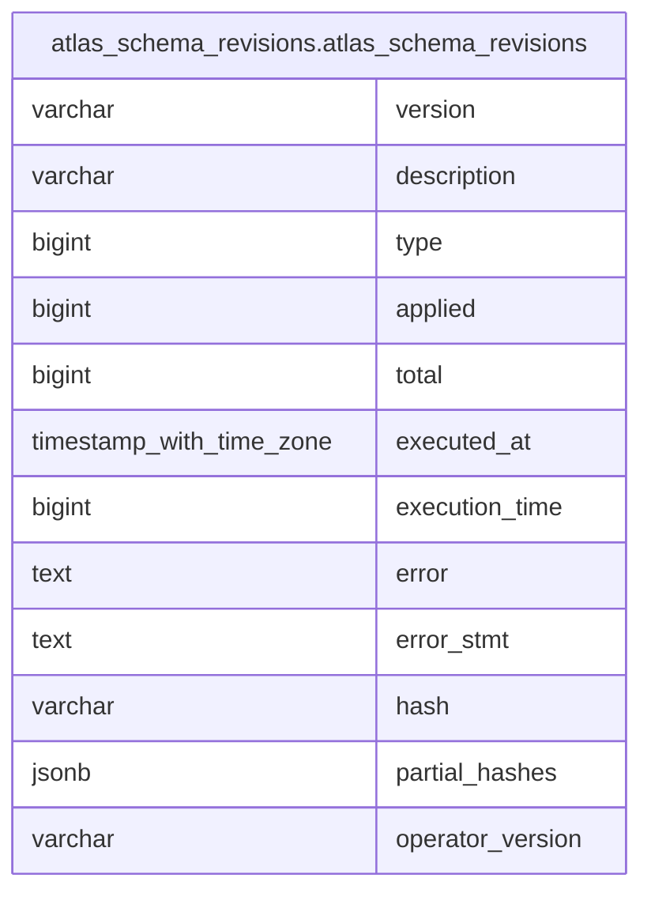

# atlas_schema_revisions.atlas_schema_revisions

## Description

## Columns

| Name             | Type                     | Default | Nullable | Children | Parents | Comment |
| ---------------- | ------------------------ | ------- | -------- | -------- | ------- | ------- |
| version          | varchar                  |         | false    |          |         |         |
| description      | varchar                  |         | false    |          |         |         |
| type             | bigint                   | 2       | false    |          |         |         |
| applied          | bigint                   | 0       | false    |          |         |         |
| total            | bigint                   | 0       | false    |          |         |         |
| executed_at      | timestamp with time zone |         | false    |          |         |         |
| execution_time   | bigint                   |         | false    |          |         |         |
| error            | text                     |         | true     |          |         |         |
| error_stmt       | text                     |         | true     |          |         |         |
| hash             | varchar                  |         | false    |          |         |         |
| partial_hashes   | jsonb                    |         | true     |          |         |         |
| operator_version | varchar                  |         | false    |          |         |         |

## Constraints

| Name                        | Type        | Definition            |
| --------------------------- | ----------- | --------------------- |
| atlas_schema_revisions_pkey | PRIMARY KEY | PRIMARY KEY (version) |

## Indexes

| Name                        | Definition                                                                                                             |
| --------------------------- | ---------------------------------------------------------------------------------------------------------------------- |
| atlas_schema_revisions_pkey | CREATE UNIQUE INDEX atlas_schema_revisions_pkey ON atlas_schema_revisions.atlas_schema_revisions USING btree (version) |

## Relations

---

> Generated by [tbls](https://github.com/k1LoW/tbls)
