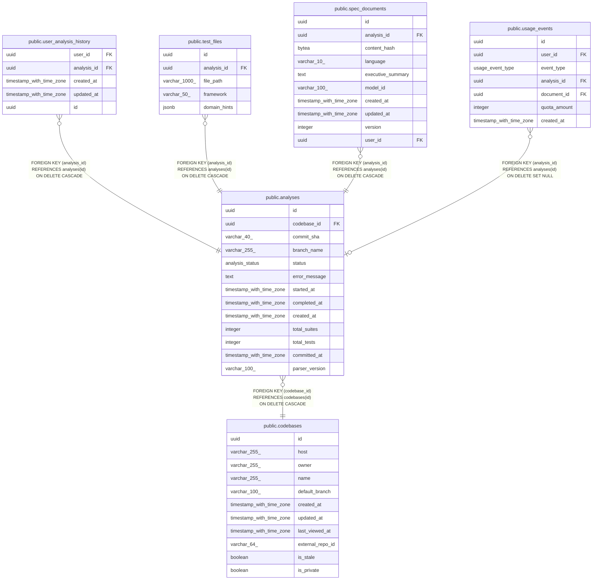

# public.analyses

## Description

## Columns

| Name           | Type                     | Default                     | Nullable | Children                                                                                                                                                                                                  | Parents                                 | Comment |
| -------------- | ------------------------ | --------------------------- | -------- | --------------------------------------------------------------------------------------------------------------------------------------------------------------------------------------------------------- | --------------------------------------- | ------- |
| id             | uuid                     | gen_random_uuid()           | false    | [public.user_analysis_history](public.user_analysis_history.md) [public.test_files](public.test_files.md) [public.spec_documents](public.spec_documents.md) [public.usage_events](public.usage_events.md) |                                         |         |
| codebase_id    | uuid                     |                             | false    |                                                                                                                                                                                                           | [public.codebases](public.codebases.md) |         |
| commit_sha     | varchar(40)              |                             | false    |                                                                                                                                                                                                           |                                         |         |
| branch_name    | varchar(255)             |                             | true     |                                                                                                                                                                                                           |                                         |         |
| status         | analysis_status          | 'pending'::analysis_status  | false    |                                                                                                                                                                                                           |                                         |         |
| error_message  | text                     |                             | true     |                                                                                                                                                                                                           |                                         |         |
| started_at     | timestamp with time zone |                             | true     |                                                                                                                                                                                                           |                                         |         |
| completed_at   | timestamp with time zone |                             | true     |                                                                                                                                                                                                           |                                         |         |
| created_at     | timestamp with time zone | now()                       | false    |                                                                                                                                                                                                           |                                         |         |
| total_suites   | integer                  | 0                           | false    |                                                                                                                                                                                                           |                                         |         |
| total_tests    | integer                  | 0                           | false    |                                                                                                                                                                                                           |                                         |         |
| committed_at   | timestamp with time zone |                             | true     |                                                                                                                                                                                                           |                                         |         |
| parser_version | varchar(100)             | 'legacy'::character varying | false    |                                                                                                                                                                                                           |                                         |         |

## Constraints

| Name                 | Type        | Definition                                                           |
| -------------------- | ----------- | -------------------------------------------------------------------- |
| fk_analyses_codebase | FOREIGN KEY | FOREIGN KEY (codebase_id) REFERENCES codebases(id) ON DELETE CASCADE |
| analyses_pkey        | PRIMARY KEY | PRIMARY KEY (id)                                                     |

## Indexes

| Name                                 | Definition                                                                                                                                                                      |
| ------------------------------------ | ------------------------------------------------------------------------------------------------------------------------------------------------------------------------------- |
| analyses_pkey                        | CREATE UNIQUE INDEX analyses_pkey ON public.analyses USING btree (id)                                                                                                           |
| idx_analyses_codebase_status         | CREATE INDEX idx_analyses_codebase_status ON public.analyses USING btree (codebase_id, status)                                                                                  |
| idx_analyses_created                 | CREATE INDEX idx_analyses_created ON public.analyses USING btree (codebase_id, created_at)                                                                                      |
| uq_analyses_completed_commit_version | CREATE UNIQUE INDEX uq_analyses_completed_commit_version ON public.analyses USING btree (codebase_id, commit_sha, parser_version) WHERE (status = 'completed'::analysis_status) |

## Relations

---

> Generated by [tbls](https://github.com/k1LoW/tbls)
