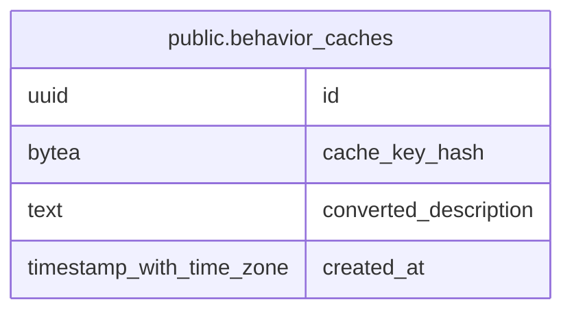

# public.behavior_caches

## Description

## Columns

| Name                  | Type                     | Default           | Nullable | Children | Parents | Comment |
| --------------------- | ------------------------ | ----------------- | -------- | -------- | ------- | ------- |
| id                    | uuid                     | gen_random_uuid() | false    |          |         |         |
| cache_key_hash        | bytea                    |                   | false    |          |         |         |
| converted_description | text                     |                   | false    |          |         |         |
| created_at            | timestamp with time zone | now()             | false    |          |         |         |

## Constraints

| Name                   | Type        | Definition              |
| ---------------------- | ----------- | ----------------------- |
| behavior_caches_pkey   | PRIMARY KEY | PRIMARY KEY (id)        |
| uq_behavior_caches_key | UNIQUE      | UNIQUE (cache_key_hash) |

## Indexes

| Name                           | Definition                                                                                        |
| ------------------------------ | ------------------------------------------------------------------------------------------------- |
| behavior_caches_pkey           | CREATE UNIQUE INDEX behavior_caches_pkey ON public.behavior_caches USING btree (id)               |
| uq_behavior_caches_key         | CREATE UNIQUE INDEX uq_behavior_caches_key ON public.behavior_caches USING btree (cache_key_hash) |
| idx_behavior_caches_created_at | CREATE INDEX idx_behavior_caches_created_at ON public.behavior_caches USING btree (created_at)    |

## Relations

---

> Generated by [tbls](https://github.com/k1LoW/tbls)
