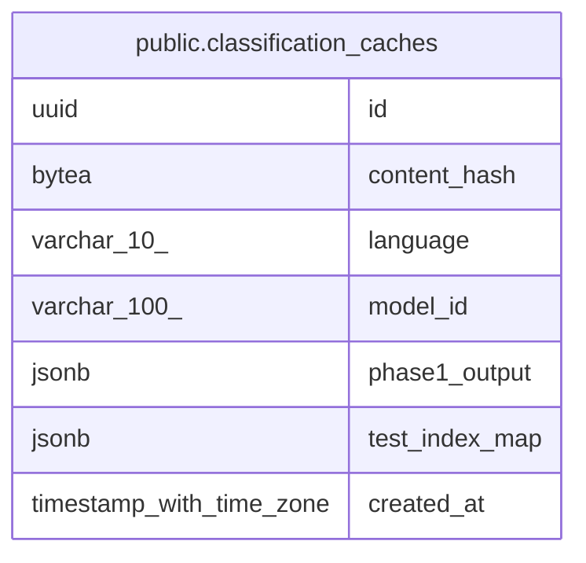

# public.classification_caches

## Description

## Columns

| Name           | Type                     | Default           | Nullable | Children | Parents | Comment |
| -------------- | ------------------------ | ----------------- | -------- | -------- | ------- | ------- |
| id             | uuid                     | gen_random_uuid() | false    |          |         |         |
| content_hash   | bytea                    |                   | false    |          |         |         |
| language       | varchar(10)              |                   | false    |          |         |         |
| model_id       | varchar(100)             |                   | false    |          |         |         |
| phase1_output  | jsonb                    |                   | false    |          |         |         |
| test_index_map | jsonb                    |                   | false    |          |         |         |
| created_at     | timestamp with time zone | now()             | false    |          |         |         |

## Constraints

| Name                         | Type        | Definition                                |
| ---------------------------- | ----------- | ----------------------------------------- |
| classification_caches_pkey   | PRIMARY KEY | PRIMARY KEY (id)                          |
| uq_classification_caches_key | UNIQUE      | UNIQUE (content_hash, language, model_id) |

## Indexes

| Name                                 | Definition                                                                                                                      |
| ------------------------------------ | ------------------------------------------------------------------------------------------------------------------------------- |
| classification_caches_pkey           | CREATE UNIQUE INDEX classification_caches_pkey ON public.classification_caches USING btree (id)                                 |
| uq_classification_caches_key         | CREATE UNIQUE INDEX uq_classification_caches_key ON public.classification_caches USING btree (content_hash, language, model_id) |
| idx_classification_caches_created_at | CREATE INDEX idx_classification_caches_created_at ON public.classification_caches USING btree (created_at)                      |

## Relations

---

> Generated by [tbls](https://github.com/k1LoW/tbls)
