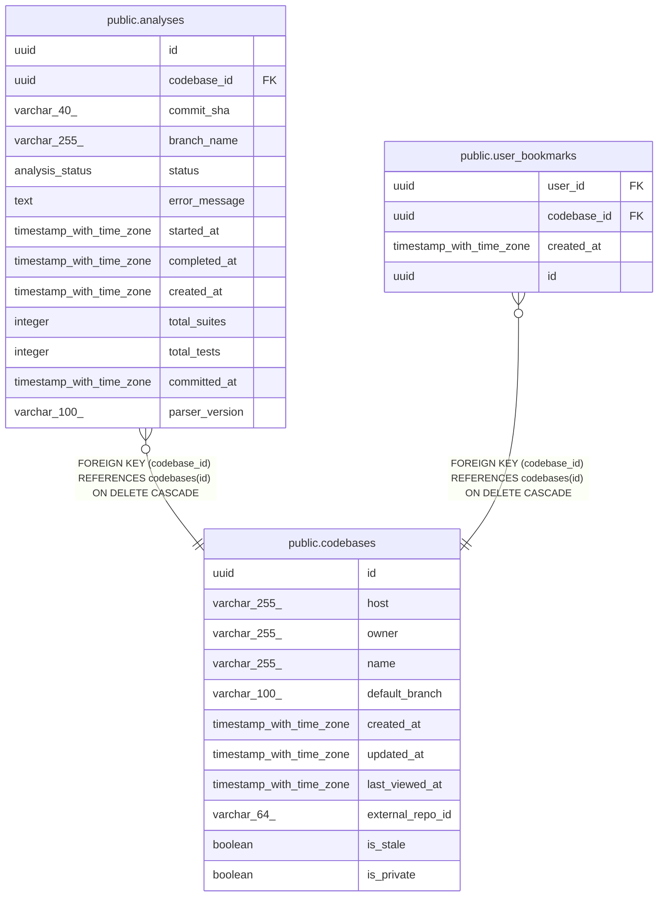

# public.codebases

## Description

## Columns

| Name             | Type                     | Default                         | Nullable | Children                                                                                | Parents | Comment |
| ---------------- | ------------------------ | ------------------------------- | -------- | --------------------------------------------------------------------------------------- | ------- | ------- |
| id               | uuid                     | gen_random_uuid()               | false    | [public.analyses](public.analyses.md) [public.user_bookmarks](public.user_bookmarks.md) |         |         |
| host             | varchar(255)             | 'github.com'::character varying | false    |                                                                                         |         |         |
| owner            | varchar(255)             |                                 | false    |                                                                                         |         |         |
| name             | varchar(255)             |                                 | false    |                                                                                         |         |         |
| default_branch   | varchar(100)             |                                 | true     |                                                                                         |         |         |
| created_at       | timestamp with time zone | now()                           | false    |                                                                                         |         |         |
| updated_at       | timestamp with time zone | now()                           | false    |                                                                                         |         |         |
| last_viewed_at   | timestamp with time zone |                                 | true     |                                                                                         |         |         |
| external_repo_id | varchar(64)              |                                 | false    |                                                                                         |         |         |
| is_stale         | boolean                  | false                           | false    |                                                                                         |         |         |
| is_private       | boolean                  | false                           | false    |                                                                                         |         |         |

## Constraints

| Name           | Type        | Definition       |
| -------------- | ----------- | ---------------- |
| codebases_pkey | PRIMARY KEY | PRIMARY KEY (id) |

## Indexes

| Name                           | Definition                                                                                                                 |
| ------------------------------ | -------------------------------------------------------------------------------------------------------------------------- |
| codebases_pkey                 | CREATE UNIQUE INDEX codebases_pkey ON public.codebases USING btree (id)                                                    |
| idx_codebases_owner_name       | CREATE INDEX idx_codebases_owner_name ON public.codebases USING btree (owner, name)                                        |
| idx_codebases_last_viewed      | CREATE INDEX idx_codebases_last_viewed ON public.codebases USING btree (last_viewed_at) WHERE (last_viewed_at IS NOT NULL) |
| idx_codebases_external_repo_id | CREATE UNIQUE INDEX idx_codebases_external_repo_id ON public.codebases USING btree (host, external_repo_id)                |
| idx_codebases_identity         | CREATE UNIQUE INDEX idx_codebases_identity ON public.codebases USING btree (host, owner, name) WHERE (is_stale = false)    |
| idx_codebases_public           | CREATE INDEX idx_codebases_public ON public.codebases USING btree (is_private) WHERE (is_private = false)                  |

## Relations

---

> Generated by [tbls](https://github.com/k1LoW/tbls)
