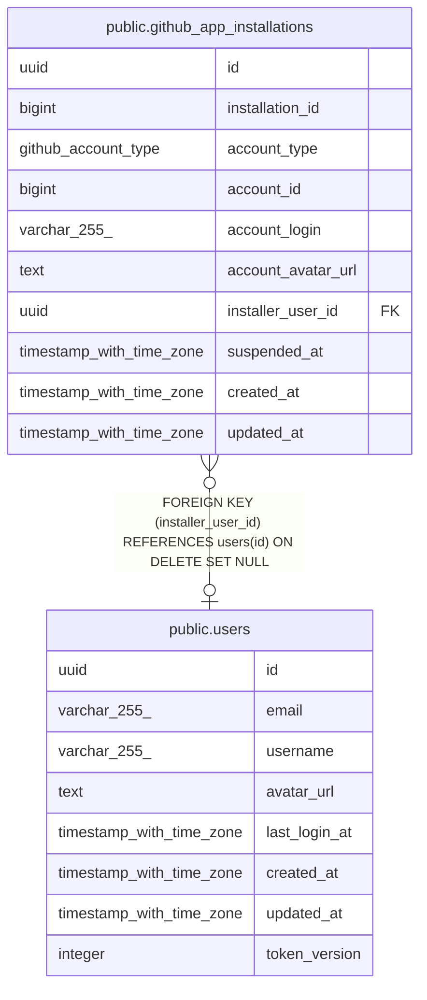

# public.github_app_installations

## Description

## Columns

| Name               | Type                     | Default           | Nullable | Children | Parents                         | Comment |
| ------------------ | ------------------------ | ----------------- | -------- | -------- | ------------------------------- | ------- |
| id                 | uuid                     | gen_random_uuid() | false    |          |                                 |         |
| installation_id    | bigint                   |                   | false    |          |                                 |         |
| account_type       | github_account_type      |                   | false    |          |                                 |         |
| account_id         | bigint                   |                   | false    |          |                                 |         |
| account_login      | varchar(255)             |                   | false    |          |                                 |         |
| account_avatar_url | text                     |                   | true     |          |                                 |         |
| installer_user_id  | uuid                     |                   | true     |          | [public.users](public.users.md) |         |
| suspended_at       | timestamp with time zone |                   | true     |          |                                 |         |
| created_at         | timestamp with time zone | now()             | false    |          |                                 |         |
| updated_at         | timestamp with time zone | now()             | false    |          |                                 |         |

## Constraints

| Name                                        | Type        | Definition                                                              |
| ------------------------------------------- | ----------- | ----------------------------------------------------------------------- |
| fk_github_app_installations_installer       | FOREIGN KEY | FOREIGN KEY (installer_user_id) REFERENCES users(id) ON DELETE SET NULL |
| github_app_installations_pkey               | PRIMARY KEY | PRIMARY KEY (id)                                                        |
| uq_github_app_installations_account         | UNIQUE      | UNIQUE (account_type, account_id)                                       |
| uq_github_app_installations_installation_id | UNIQUE      | UNIQUE (installation_id)                                                |

## Indexes

| Name                                        | Definition                                                                                                                                                   |
| ------------------------------------------- | ------------------------------------------------------------------------------------------------------------------------------------------------------------ |
| github_app_installations_pkey               | CREATE UNIQUE INDEX github_app_installations_pkey ON public.github_app_installations USING btree (id)                                                        |
| uq_github_app_installations_account         | CREATE UNIQUE INDEX uq_github_app_installations_account ON public.github_app_installations USING btree (account_type, account_id)                            |
| uq_github_app_installations_installation_id | CREATE UNIQUE INDEX uq_github_app_installations_installation_id ON public.github_app_installations USING btree (installation_id)                             |
| idx_github_app_installations_installer      | CREATE INDEX idx_github_app_installations_installer ON public.github_app_installations USING btree (installer_user_id) WHERE (installer_user_id IS NOT NULL) |

## Relations

---

> Generated by [tbls](https://github.com/k1LoW/tbls)
