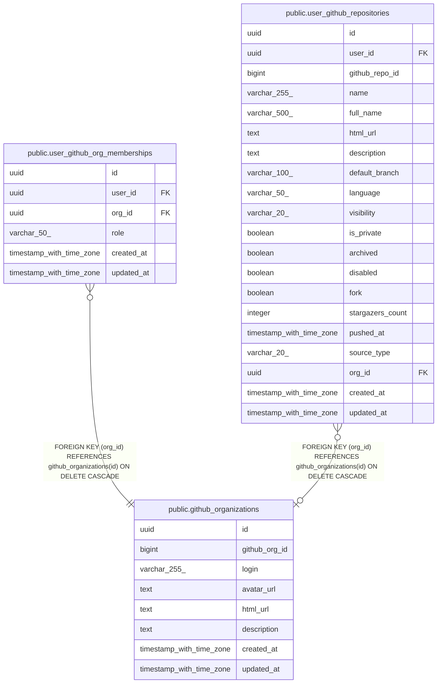

# public.github_organizations

## Description

## Columns

| Name          | Type                     | Default           | Nullable | Children                                                                                                                                          | Parents | Comment |
| ------------- | ------------------------ | ----------------- | -------- | ------------------------------------------------------------------------------------------------------------------------------------------------- | ------- | ------- |
| id            | uuid                     | gen_random_uuid() | false    | [public.user_github_org_memberships](public.user_github_org_memberships.md) [public.user_github_repositories](public.user_github_repositories.md) |         |         |
| github_org_id | bigint                   |                   | false    |                                                                                                                                                   |         |         |
| login         | varchar(255)             |                   | false    |                                                                                                                                                   |         |         |
| avatar_url    | text                     |                   | true     |                                                                                                                                                   |         |         |
| html_url      | text                     |                   | true     |                                                                                                                                                   |         |         |
| description   | text                     |                   | true     |                                                                                                                                                   |         |         |
| created_at    | timestamp with time zone | now()             | false    |                                                                                                                                                   |         |         |
| updated_at    | timestamp with time zone | now()             | false    |                                                                                                                                                   |         |         |

## Constraints

| Name                                  | Type        | Definition             |
| ------------------------------------- | ----------- | ---------------------- |
| github_organizations_pkey             | PRIMARY KEY | PRIMARY KEY (id)       |
| uq_github_organizations_github_org_id | UNIQUE      | UNIQUE (github_org_id) |

## Indexes

| Name                                  | Definition                                                                                                           |
| ------------------------------------- | -------------------------------------------------------------------------------------------------------------------- |
| github_organizations_pkey             | CREATE UNIQUE INDEX github_organizations_pkey ON public.github_organizations USING btree (id)                        |
| uq_github_organizations_github_org_id | CREATE UNIQUE INDEX uq_github_organizations_github_org_id ON public.github_organizations USING btree (github_org_id) |
| idx_github_organizations_login        | CREATE INDEX idx_github_organizations_login ON public.github_organizations USING btree (login)                       |

## Relations

---

> Generated by [tbls](https://github.com/k1LoW/tbls)
