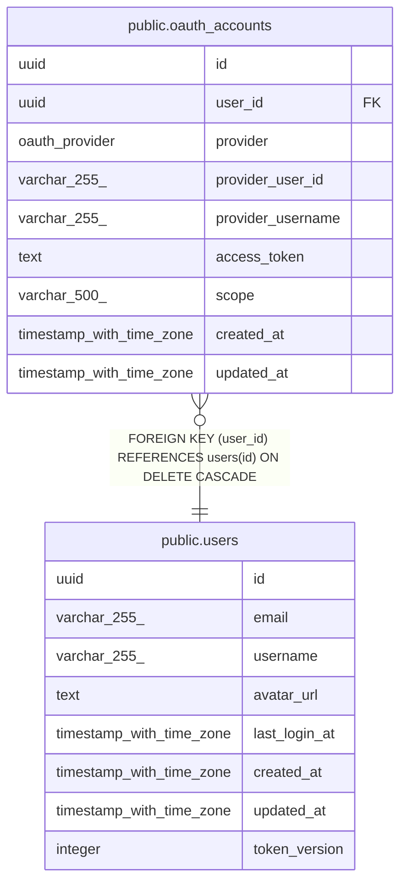

# public.oauth_accounts

## Description

## Columns

| Name              | Type                     | Default           | Nullable | Children | Parents                         | Comment |
| ----------------- | ------------------------ | ----------------- | -------- | -------- | ------------------------------- | ------- |
| id                | uuid                     | gen_random_uuid() | false    |          |                                 |         |
| user_id           | uuid                     |                   | false    |          | [public.users](public.users.md) |         |
| provider          | oauth_provider           |                   | false    |          |                                 |         |
| provider_user_id  | varchar(255)             |                   | false    |          |                                 |         |
| provider_username | varchar(255)             |                   | true     |          |                                 |         |
| access_token      | text                     |                   | true     |          |                                 |         |
| scope             | varchar(500)             |                   | true     |          |                                 |         |
| created_at        | timestamp with time zone | now()             | false    |          |                                 |         |
| updated_at        | timestamp with time zone | now()             | false    |          |                                 |         |

## Constraints

| Name                   | Type        | Definition                                                   |
| ---------------------- | ----------- | ------------------------------------------------------------ |
| fk_oauth_accounts_user | FOREIGN KEY | FOREIGN KEY (user_id) REFERENCES users(id) ON DELETE CASCADE |
| oauth_accounts_pkey    | PRIMARY KEY | PRIMARY KEY (id)                                             |
| uq_oauth_provider_user | UNIQUE      | UNIQUE (provider, provider_user_id)                          |

## Indexes

| Name                             | Definition                                                                                                   |
| -------------------------------- | ------------------------------------------------------------------------------------------------------------ |
| oauth_accounts_pkey              | CREATE UNIQUE INDEX oauth_accounts_pkey ON public.oauth_accounts USING btree (id)                            |
| uq_oauth_provider_user           | CREATE UNIQUE INDEX uq_oauth_provider_user ON public.oauth_accounts USING btree (provider, provider_user_id) |
| idx_oauth_accounts_user_id       | CREATE INDEX idx_oauth_accounts_user_id ON public.oauth_accounts USING btree (user_id)                       |
| idx_oauth_accounts_user_provider | CREATE INDEX idx_oauth_accounts_user_provider ON public.oauth_accounts USING btree (user_id, provider)       |

## Relations

---

> Generated by [tbls](https://github.com/k1LoW/tbls)
