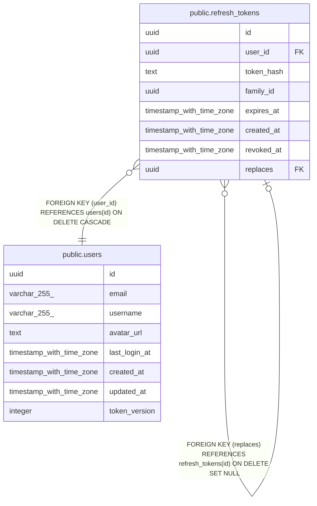

# public.refresh_tokens

## Description

## Columns

| Name       | Type                     | Default           | Nullable | Children                                          | Parents                                           | Comment |
| ---------- | ------------------------ | ----------------- | -------- | ------------------------------------------------- | ------------------------------------------------- | ------- |
| id         | uuid                     | gen_random_uuid() | false    | [public.refresh_tokens](public.refresh_tokens.md) |                                                   |         |
| user_id    | uuid                     |                   | false    |                                                   | [public.users](public.users.md)                   |         |
| token_hash | text                     |                   | false    |                                                   |                                                   |         |
| family_id  | uuid                     |                   | false    |                                                   |                                                   |         |
| expires_at | timestamp with time zone |                   | false    |                                                   |                                                   |         |
| created_at | timestamp with time zone | now()             | false    |                                                   |                                                   |         |
| revoked_at | timestamp with time zone |                   | true     |                                                   |                                                   |         |
| replaces   | uuid                     |                   | true     |                                                   | [public.refresh_tokens](public.refresh_tokens.md) |         |

## Constraints

| Name                       | Type        | Definition                                                              |
| -------------------------- | ----------- | ----------------------------------------------------------------------- |
| fk_refresh_tokens_user     | FOREIGN KEY | FOREIGN KEY (user_id) REFERENCES users(id) ON DELETE CASCADE            |
| fk_refresh_tokens_replaces | FOREIGN KEY | FOREIGN KEY (replaces) REFERENCES refresh_tokens(id) ON DELETE SET NULL |
| refresh_tokens_pkey        | PRIMARY KEY | PRIMARY KEY (id)                                                        |
| uq_refresh_tokens_hash     | UNIQUE      | UNIQUE (token_hash)                                                     |

## Indexes

| Name                             | Definition                                                                                                                            |
| -------------------------------- | ------------------------------------------------------------------------------------------------------------------------------------- |
| refresh_tokens_pkey              | CREATE UNIQUE INDEX refresh_tokens_pkey ON public.refresh_tokens USING btree (id)                                                     |
| uq_refresh_tokens_hash           | CREATE UNIQUE INDEX uq_refresh_tokens_hash ON public.refresh_tokens USING btree (token_hash)                                          |
| idx_refresh_tokens_expires       | CREATE INDEX idx_refresh_tokens_expires ON public.refresh_tokens USING btree (expires_at) WHERE (revoked_at IS NULL)                  |
| idx_refresh_tokens_family_active | CREATE INDEX idx_refresh_tokens_family_active ON public.refresh_tokens USING btree (family_id, created_at) WHERE (revoked_at IS NULL) |
| idx_refresh_tokens_user          | CREATE INDEX idx_refresh_tokens_user ON public.refresh_tokens USING btree (user_id)                                                   |

## Relations

---

> Generated by [tbls](https://github.com/k1LoW/tbls)
