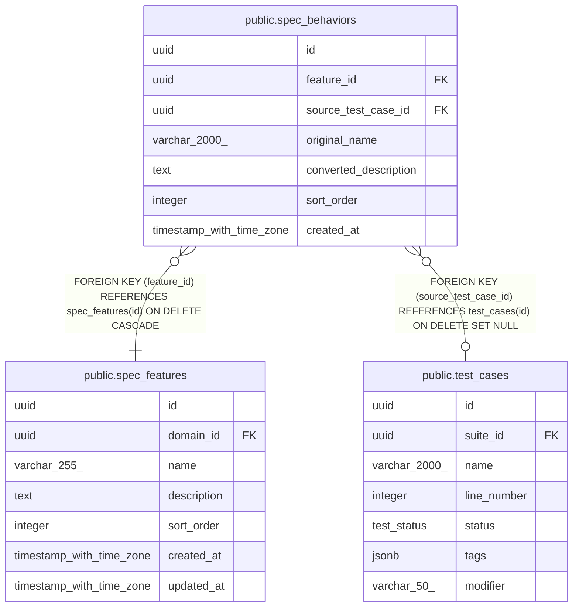

# public.spec_behaviors

## Description

## Columns

| Name                  | Type                     | Default           | Nullable | Children | Parents                                         | Comment |
| --------------------- | ------------------------ | ----------------- | -------- | -------- | ----------------------------------------------- | ------- |
| id                    | uuid                     | gen_random_uuid() | false    |          |                                                 |         |
| feature_id            | uuid                     |                   | false    |          | [public.spec_features](public.spec_features.md) |         |
| source_test_case_id   | uuid                     |                   | true     |          | [public.test_cases](public.test_cases.md)       |         |
| original_name         | varchar(2000)            |                   | false    |          |                                                 |         |
| converted_description | text                     |                   | false    |          |                                                 |         |
| sort_order            | integer                  | 0                 | false    |          |                                                 |         |
| created_at            | timestamp with time zone | now()             | false    |          |                                                 |         |

## Constraints

| Name                        | Type        | Definition                                                                     |
| --------------------------- | ----------- | ------------------------------------------------------------------------------ |
| fk_spec_behaviors_test_case | FOREIGN KEY | FOREIGN KEY (source_test_case_id) REFERENCES test_cases(id) ON DELETE SET NULL |
| fk_spec_behaviors_feature   | FOREIGN KEY | FOREIGN KEY (feature_id) REFERENCES spec_features(id) ON DELETE CASCADE        |
| spec_behaviors_pkey         | PRIMARY KEY | PRIMARY KEY (id)                                                               |

## Indexes

| Name                            | Definition                                                                                                                                |
| ------------------------------- | ----------------------------------------------------------------------------------------------------------------------------------------- |
| spec_behaviors_pkey             | CREATE UNIQUE INDEX spec_behaviors_pkey ON public.spec_behaviors USING btree (id)                                                         |
| idx_spec_behaviors_feature_sort | CREATE INDEX idx_spec_behaviors_feature_sort ON public.spec_behaviors USING btree (feature_id, sort_order)                                |
| idx_spec_behaviors_source       | CREATE INDEX idx_spec_behaviors_source ON public.spec_behaviors USING btree (source_test_case_id) WHERE (source_test_case_id IS NOT NULL) |

## Relations

---

> Generated by [tbls](https://github.com/k1LoW/tbls)
