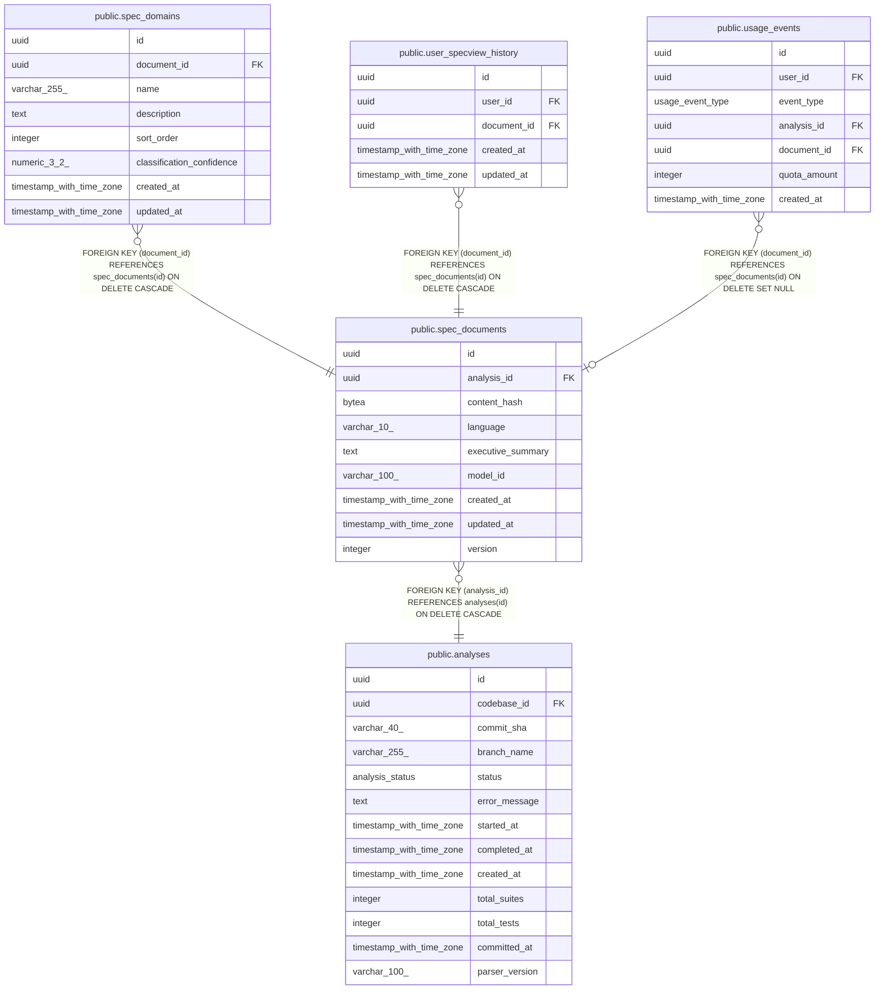

# public.spec_documents

## Description

## Columns

| Name              | Type                     | Default                 | Nullable | Children                                                                                                                                                    | Parents                               | Comment |
| ----------------- | ------------------------ | ----------------------- | -------- | ----------------------------------------------------------------------------------------------------------------------------------------------------------- | ------------------------------------- | ------- |
| id                | uuid                     | gen_random_uuid()       | false    | [public.spec_domains](public.spec_domains.md) [public.user_specview_history](public.user_specview_history.md) [public.usage_events](public.usage_events.md) |                                       |         |
| analysis_id       | uuid                     |                         | false    |                                                                                                                                                             | [public.analyses](public.analyses.md) |         |
| content_hash      | bytea                    |                         | false    |                                                                                                                                                             |                                       |         |
| language          | varchar(10)              | 'en'::character varying | false    |                                                                                                                                                             |                                       |         |
| executive_summary | text                     |                         | true     |                                                                                                                                                             |                                       |         |
| model_id          | varchar(100)             |                         | false    |                                                                                                                                                             |                                       |         |
| created_at        | timestamp with time zone | now()                   | false    |                                                                                                                                                             |                                       |         |
| updated_at        | timestamp with time zone | now()                   | false    |                                                                                                                                                             |                                       |         |
| version           | integer                  | 1                       | false    |                                                                                                                                                             |                                       |         |

## Constraints

| Name                                      | Type        | Definition                                                          |
| ----------------------------------------- | ----------- | ------------------------------------------------------------------- |
| fk_spec_documents_analysis                | FOREIGN KEY | FOREIGN KEY (analysis_id) REFERENCES analyses(id) ON DELETE CASCADE |
| spec_documents_pkey                       | PRIMARY KEY | PRIMARY KEY (id)                                                    |
| uq_spec_documents_analysis_lang_version   | UNIQUE      | UNIQUE (analysis_id, language, version)                             |
| uq_spec_documents_hash_lang_model_version | UNIQUE      | UNIQUE (content_hash, language, model_id, version)                  |

## Indexes

| Name                                      | Definition                                                                                                                                     |
| ----------------------------------------- | ---------------------------------------------------------------------------------------------------------------------------------------------- |
| spec_documents_pkey                       | CREATE UNIQUE INDEX spec_documents_pkey ON public.spec_documents USING btree (id)                                                              |
| idx_spec_documents_analysis               | CREATE INDEX idx_spec_documents_analysis ON public.spec_documents USING btree (analysis_id)                                                    |
| uq_spec_documents_analysis_lang_version   | CREATE UNIQUE INDEX uq_spec_documents_analysis_lang_version ON public.spec_documents USING btree (analysis_id, language, version)              |
| uq_spec_documents_hash_lang_model_version | CREATE UNIQUE INDEX uq_spec_documents_hash_lang_model_version ON public.spec_documents USING btree (content_hash, language, model_id, version) |

## Relations

---

> Generated by [tbls](https://github.com/k1LoW/tbls)
