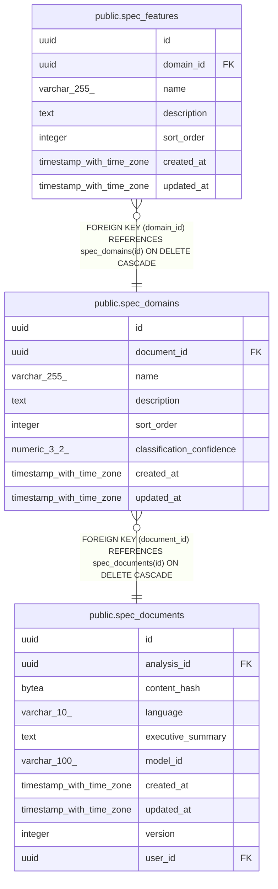

# public.spec_domains

## Description

## Columns

| Name                      | Type                     | Default           | Nullable | Children                                        | Parents                                           | Comment |
| ------------------------- | ------------------------ | ----------------- | -------- | ----------------------------------------------- | ------------------------------------------------- | ------- |
| id                        | uuid                     | gen_random_uuid() | false    | [public.spec_features](public.spec_features.md) |                                                   |         |
| document_id               | uuid                     |                   | false    |                                                 | [public.spec_documents](public.spec_documents.md) |         |
| name                      | varchar(255)             |                   | false    |                                                 |                                                   |         |
| description               | text                     |                   | true     |                                                 |                                                   |         |
| sort_order                | integer                  | 0                 | false    |                                                 |                                                   |         |
| classification_confidence | numeric(3,2)             |                   | true     |                                                 |                                                   |         |
| created_at                | timestamp with time zone | now()             | false    |                                                 |                                                   |         |
| updated_at                | timestamp with time zone | now()             | false    |                                                 |                                                   |         |

## Constraints

| Name                     | Type        | Definition                                                                |
| ------------------------ | ----------- | ------------------------------------------------------------------------- |
| fk_spec_domains_document | FOREIGN KEY | FOREIGN KEY (document_id) REFERENCES spec_documents(id) ON DELETE CASCADE |
| spec_domains_pkey        | PRIMARY KEY | PRIMARY KEY (id)                                                          |

## Indexes

| Name                           | Definition                                                                                               |
| ------------------------------ | -------------------------------------------------------------------------------------------------------- |
| spec_domains_pkey              | CREATE UNIQUE INDEX spec_domains_pkey ON public.spec_domains USING btree (id)                            |
| idx_spec_domains_document_sort | CREATE INDEX idx_spec_domains_document_sort ON public.spec_domains USING btree (document_id, sort_order) |

## Relations

---

> Generated by [tbls](https://github.com/k1LoW/tbls)
