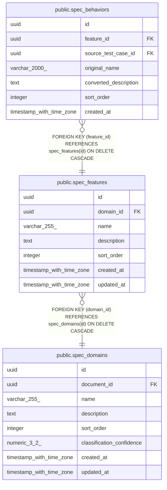

# public.spec_features

## Description

## Columns

| Name        | Type                     | Default           | Nullable | Children                                          | Parents                                       | Comment |
| ----------- | ------------------------ | ----------------- | -------- | ------------------------------------------------- | --------------------------------------------- | ------- |
| id          | uuid                     | gen_random_uuid() | false    | [public.spec_behaviors](public.spec_behaviors.md) |                                               |         |
| domain_id   | uuid                     |                   | false    |                                                   | [public.spec_domains](public.spec_domains.md) |         |
| name        | varchar(255)             |                   | false    |                                                   |                                               |         |
| description | text                     |                   | true     |                                                   |                                               |         |
| sort_order  | integer                  | 0                 | false    |                                                   |                                               |         |
| created_at  | timestamp with time zone | now()             | false    |                                                   |                                               |         |
| updated_at  | timestamp with time zone | now()             | false    |                                                   |                                               |         |

## Constraints

| Name                    | Type        | Definition                                                            |
| ----------------------- | ----------- | --------------------------------------------------------------------- |
| fk_spec_features_domain | FOREIGN KEY | FOREIGN KEY (domain_id) REFERENCES spec_domains(id) ON DELETE CASCADE |
| spec_features_pkey      | PRIMARY KEY | PRIMARY KEY (id)                                                      |

## Indexes

| Name                          | Definition                                                                                             |
| ----------------------------- | ------------------------------------------------------------------------------------------------------ |
| spec_features_pkey            | CREATE UNIQUE INDEX spec_features_pkey ON public.spec_features USING btree (id)                        |
| idx_spec_features_domain_sort | CREATE INDEX idx_spec_features_domain_sort ON public.spec_features USING btree (domain_id, sort_order) |

## Relations

---

> Generated by [tbls](https://github.com/k1LoW/tbls)
