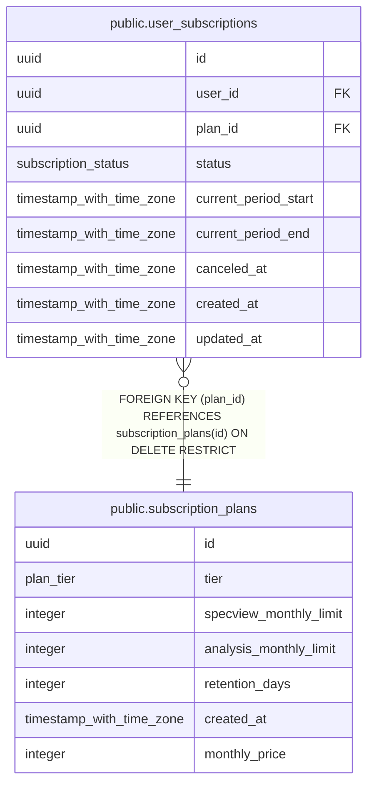

# public.subscription_plans

## Description

## Columns

| Name                   | Type                     | Default           | Nullable | Children                                                  | Parents | Comment |
| ---------------------- | ------------------------ | ----------------- | -------- | --------------------------------------------------------- | ------- | ------- |
| id                     | uuid                     | gen_random_uuid() | false    | [public.user_subscriptions](public.user_subscriptions.md) |         |         |
| tier                   | plan_tier                |                   | false    |                                                           |         |         |
| specview_monthly_limit | integer                  |                   | true     |                                                           |         |         |
| analysis_monthly_limit | integer                  |                   | true     |                                                           |         |         |
| retention_days         | integer                  |                   | true     |                                                           |         |         |
| created_at             | timestamp with time zone | now()             | false    |                                                           |         |         |
| monthly_price          | integer                  |                   | true     |                                                           |         |         |

## Constraints

| Name                       | Type        | Definition       |
| -------------------------- | ----------- | ---------------- |
| subscription_plans_pkey    | PRIMARY KEY | PRIMARY KEY (id) |
| uq_subscription_plans_tier | UNIQUE      | UNIQUE (tier)    |

## Indexes

| Name                       | Definition                                                                                     |
| -------------------------- | ---------------------------------------------------------------------------------------------- |
| subscription_plans_pkey    | CREATE UNIQUE INDEX subscription_plans_pkey ON public.subscription_plans USING btree (id)      |
| uq_subscription_plans_tier | CREATE UNIQUE INDEX uq_subscription_plans_tier ON public.subscription_plans USING btree (tier) |

## Relations

---

> Generated by [tbls](https://github.com/k1LoW/tbls)
