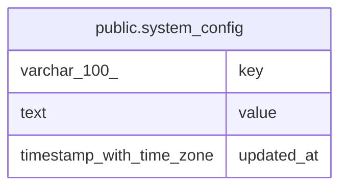

# public.system_config

## Description

## Columns

| Name       | Type                     | Default | Nullable | Children | Parents | Comment |
| ---------- | ------------------------ | ------- | -------- | -------- | ------- | ------- |
| key        | varchar(100)             |         | false    |          |         |         |
| value      | text                     |         | false    |          |         |         |
| updated_at | timestamp with time zone | now()   | false    |          |         |         |

## Constraints

| Name               | Type        | Definition        |
| ------------------ | ----------- | ----------------- |
| system_config_pkey | PRIMARY KEY | PRIMARY KEY (key) |

## Indexes

| Name               | Definition                                                                       |
| ------------------ | -------------------------------------------------------------------------------- |
| system_config_pkey | CREATE UNIQUE INDEX system_config_pkey ON public.system_config USING btree (key) |

## Relations

---

> Generated by [tbls](https://github.com/k1LoW/tbls)
