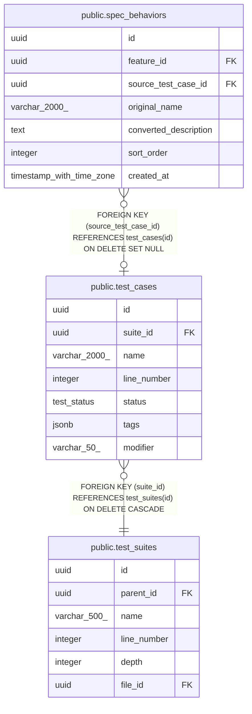

# public.test_cases

## Description

## Columns

| Name        | Type          | Default               | Nullable | Children                                          | Parents                                     | Comment |
| ----------- | ------------- | --------------------- | -------- | ------------------------------------------------- | ------------------------------------------- | ------- |
| id          | uuid          | gen_random_uuid()     | false    | [public.spec_behaviors](public.spec_behaviors.md) |                                             |         |
| suite_id    | uuid          |                       | false    |                                                   | [public.test_suites](public.test_suites.md) |         |
| name        | varchar(2000) |                       | false    |                                                   |                                             |         |
| line_number | integer       |                       | true     |                                                   |                                             |         |
| status      | test_status   | 'active'::test_status | false    |                                                   |                                             |         |
| tags        | jsonb         | '[]'::jsonb           | false    |                                                   |                                             |         |
| modifier    | varchar(50)   |                       | true     |                                                   |                                             |         |

## Constraints

| Name                | Type        | Definition                                                          |
| ------------------- | ----------- | ------------------------------------------------------------------- |
| fk_test_cases_suite | FOREIGN KEY | FOREIGN KEY (suite_id) REFERENCES test_suites(id) ON DELETE CASCADE |
| test_cases_pkey     | PRIMARY KEY | PRIMARY KEY (id)                                                    |

## Indexes

| Name                  | Definition                                                                             |
| --------------------- | -------------------------------------------------------------------------------------- |
| test_cases_pkey       | CREATE UNIQUE INDEX test_cases_pkey ON public.test_cases USING btree (id)              |
| idx_test_cases_status | CREATE INDEX idx_test_cases_status ON public.test_cases USING btree (suite_id, status) |
| idx_test_cases_suite  | CREATE INDEX idx_test_cases_suite ON public.test_cases USING btree (suite_id)          |

## Relations

---

> Generated by [tbls](https://github.com/k1LoW/tbls)
