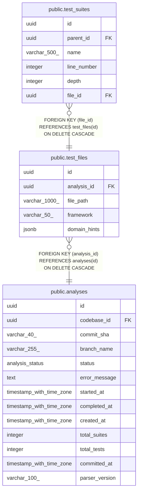

# public.test_files

## Description

## Columns

| Name         | Type          | Default           | Nullable | Children                                    | Parents                               | Comment |
| ------------ | ------------- | ----------------- | -------- | ------------------------------------------- | ------------------------------------- | ------- |
| id           | uuid          | gen_random_uuid() | false    | [public.test_suites](public.test_suites.md) |                                       |         |
| analysis_id  | uuid          |                   | false    |                                             | [public.analyses](public.analyses.md) |         |
| file_path    | varchar(1000) |                   | false    |                                             |                                       |         |
| framework    | varchar(50)   |                   | true     |                                             |                                       |         |
| domain_hints | jsonb         |                   | true     |                                             |                                       |         |

## Constraints

| Name                        | Type        | Definition                                                          |
| --------------------------- | ----------- | ------------------------------------------------------------------- |
| fk_test_files_analysis      | FOREIGN KEY | FOREIGN KEY (analysis_id) REFERENCES analyses(id) ON DELETE CASCADE |
| test_files_pkey             | PRIMARY KEY | PRIMARY KEY (id)                                                    |
| uq_test_files_analysis_path | UNIQUE      | UNIQUE (analysis_id, file_path)                                     |

## Indexes

| Name                        | Definition                                                                                                |
| --------------------------- | --------------------------------------------------------------------------------------------------------- |
| test_files_pkey             | CREATE UNIQUE INDEX test_files_pkey ON public.test_files USING btree (id)                                 |
| uq_test_files_analysis_path | CREATE UNIQUE INDEX uq_test_files_analysis_path ON public.test_files USING btree (analysis_id, file_path) |
| idx_test_files_analysis     | CREATE INDEX idx_test_files_analysis ON public.test_files USING btree (analysis_id)                       |

## Relations

---

> Generated by [tbls](https://github.com/k1LoW/tbls)
