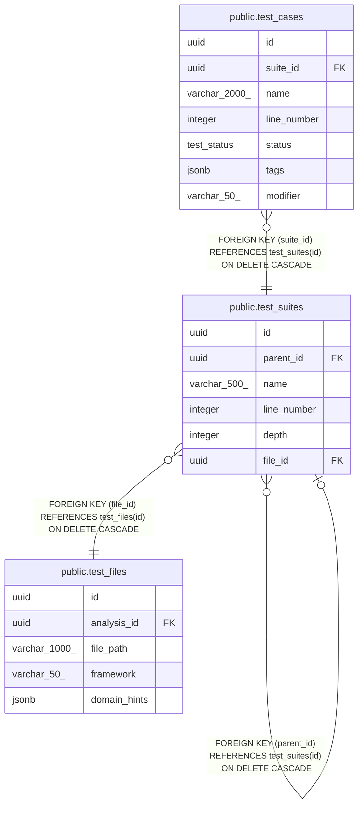

# public.test_suites

## Description

## Columns

| Name        | Type         | Default           | Nullable | Children                                                                              | Parents                                     | Comment |
| ----------- | ------------ | ----------------- | -------- | ------------------------------------------------------------------------------------- | ------------------------------------------- | ------- |
| id          | uuid         | gen_random_uuid() | false    | [public.test_suites](public.test_suites.md) [public.test_cases](public.test_cases.md) |                                             |         |
| parent_id   | uuid         |                   | true     |                                                                                       | [public.test_suites](public.test_suites.md) |         |
| name        | varchar(500) |                   | false    |                                                                                       |                                             |         |
| line_number | integer      |                   | true     |                                                                                       |                                             |         |
| depth       | integer      | 0                 | false    |                                                                                       |                                             |         |
| file_id     | uuid         |                   | false    |                                                                                       | [public.test_files](public.test_files.md)   |         |

## Constraints

| Name                  | Type        | Definition                                                           |
| --------------------- | ----------- | -------------------------------------------------------------------- |
| chk_no_self_reference | CHECK       | CHECK ((id <> parent_id))                                            |
| fk_test_suites_parent | FOREIGN KEY | FOREIGN KEY (parent_id) REFERENCES test_suites(id) ON DELETE CASCADE |
| test_suites_pkey      | PRIMARY KEY | PRIMARY KEY (id)                                                     |
| fk_test_suites_file   | FOREIGN KEY | FOREIGN KEY (file_id) REFERENCES test_files(id) ON DELETE CASCADE    |

## Indexes

| Name                   | Definition                                                                                                      |
| ---------------------- | --------------------------------------------------------------------------------------------------------------- |
| test_suites_pkey       | CREATE UNIQUE INDEX test_suites_pkey ON public.test_suites USING btree (id)                                     |
| idx_test_suites_parent | CREATE INDEX idx_test_suites_parent ON public.test_suites USING btree (parent_id) WHERE (parent_id IS NOT NULL) |
| idx_test_suites_file   | CREATE INDEX idx_test_suites_file ON public.test_suites USING btree (file_id)                                   |

## Relations

---

> Generated by [tbls](https://github.com/k1LoW/tbls)
