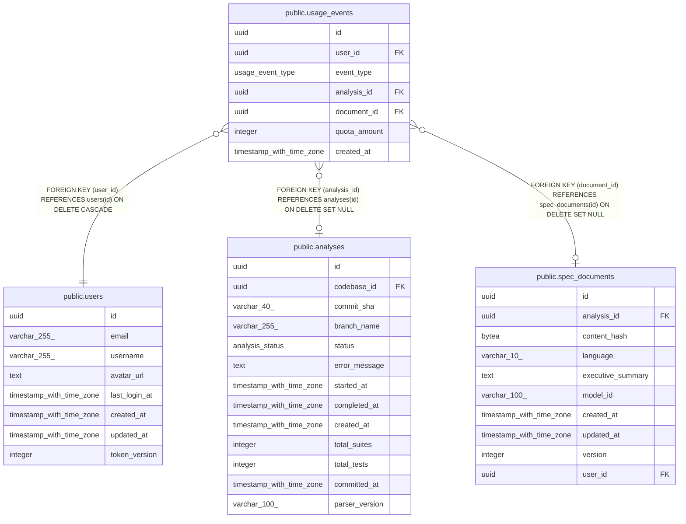

# public.usage_events

## Description

## Columns

| Name         | Type                     | Default           | Nullable | Children | Parents                                           | Comment |
| ------------ | ------------------------ | ----------------- | -------- | -------- | ------------------------------------------------- | ------- |
| id           | uuid                     | gen_random_uuid() | false    |          |                                                   |         |
| user_id      | uuid                     |                   | false    |          | [public.users](public.users.md)                   |         |
| event_type   | usage_event_type         |                   | false    |          |                                                   |         |
| analysis_id  | uuid                     |                   | true     |          | [public.analyses](public.analyses.md)             |         |
| document_id  | uuid                     |                   | true     |          | [public.spec_documents](public.spec_documents.md) |         |
| quota_amount | integer                  |                   | false    |          |                                                   |         |
| created_at   | timestamp with time zone | now()             | false    |          |                                                   |         |

## Constraints

| Name                      | Type        | Definition                                                                                  |
| ------------------------- | ----------- | ------------------------------------------------------------------------------------------- |
| chk_usage_events_resource | CHECK       | CHECK (((((analysis_id IS NOT NULL))::integer + ((document_id IS NOT NULL))::integer) = 1)) |
| fk_usage_events_analysis  | FOREIGN KEY | FOREIGN KEY (analysis_id) REFERENCES analyses(id) ON DELETE SET NULL                        |
| fk_usage_events_user      | FOREIGN KEY | FOREIGN KEY (user_id) REFERENCES users(id) ON DELETE CASCADE                                |
| fk_usage_events_document  | FOREIGN KEY | FOREIGN KEY (document_id) REFERENCES spec_documents(id) ON DELETE SET NULL                  |
| usage_events_pkey         | PRIMARY KEY | PRIMARY KEY (id)                                                                            |

## Indexes

| Name                          | Definition                                                                                                              |
| ----------------------------- | ----------------------------------------------------------------------------------------------------------------------- |
| usage_events_pkey             | CREATE UNIQUE INDEX usage_events_pkey ON public.usage_events USING btree (id)                                           |
| idx_usage_events_analysis     | CREATE INDEX idx_usage_events_analysis ON public.usage_events USING btree (analysis_id) WHERE (analysis_id IS NOT NULL) |
| idx_usage_events_document     | CREATE INDEX idx_usage_events_document ON public.usage_events USING btree (document_id) WHERE (document_id IS NOT NULL) |
| idx_usage_events_quota_lookup | CREATE INDEX idx_usage_events_quota_lookup ON public.usage_events USING btree (user_id, event_type, created_at)         |

## Relations

---

> Generated by [tbls](https://github.com/k1LoW/tbls)
