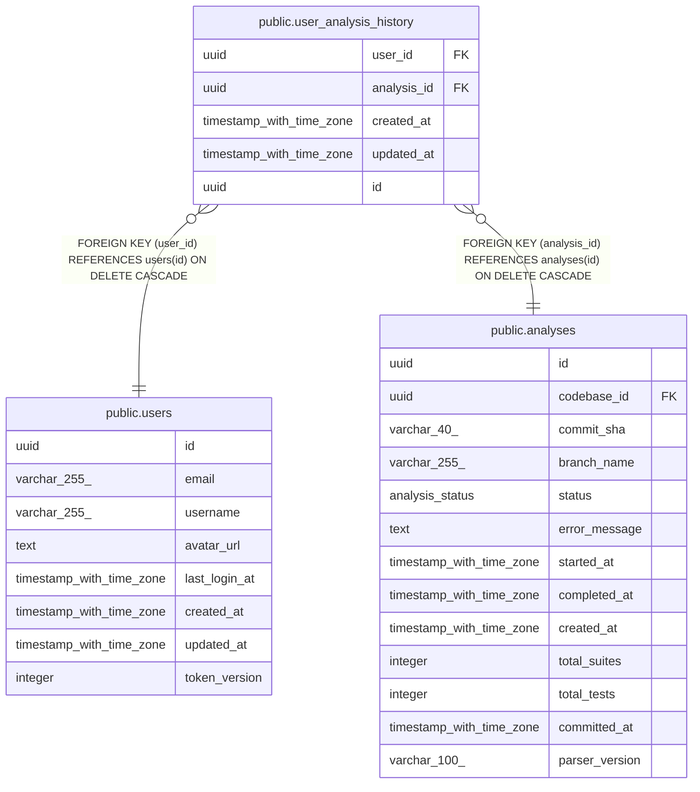

# public.user_analysis_history

## Description

## Columns

| Name        | Type                     | Default           | Nullable | Children | Parents                               | Comment |
| ----------- | ------------------------ | ----------------- | -------- | -------- | ------------------------------------- | ------- |
| user_id     | uuid                     |                   | false    |          | [public.users](public.users.md)       |         |
| analysis_id | uuid                     |                   | false    |          | [public.analyses](public.analyses.md) |         |
| created_at  | timestamp with time zone | now()             | false    |          |                                       |         |
| updated_at  | timestamp with time zone | now()             | false    |          |                                       |         |
| id          | uuid                     | gen_random_uuid() | false    |          |                                       |         |

## Constraints

| Name                                   | Type        | Definition                                                          |
| -------------------------------------- | ----------- | ------------------------------------------------------------------- |
| fk_user_analysis_history_analysis      | FOREIGN KEY | FOREIGN KEY (analysis_id) REFERENCES analyses(id) ON DELETE CASCADE |
| fk_user_analysis_history_user          | FOREIGN KEY | FOREIGN KEY (user_id) REFERENCES users(id) ON DELETE CASCADE        |
| user_analysis_history_pkey             | PRIMARY KEY | PRIMARY KEY (id)                                                    |
| uq_user_analysis_history_user_analysis | UNIQUE      | UNIQUE (user_id, analysis_id)                                       |

## Indexes

| Name                                   | Definition                                                                                                                    |
| -------------------------------------- | ----------------------------------------------------------------------------------------------------------------------------- |
| idx_user_analysis_history_analysis     | CREATE INDEX idx_user_analysis_history_analysis ON public.user_analysis_history USING btree (analysis_id)                     |
| user_analysis_history_pkey             | CREATE UNIQUE INDEX user_analysis_history_pkey ON public.user_analysis_history USING btree (id)                               |
| uq_user_analysis_history_user_analysis | CREATE UNIQUE INDEX uq_user_analysis_history_user_analysis ON public.user_analysis_history USING btree (user_id, analysis_id) |
| idx_user_analysis_history_cursor       | CREATE INDEX idx_user_analysis_history_cursor ON public.user_analysis_history USING btree (user_id, updated_at, id)           |

## Relations

---

> Generated by [tbls](https://github.com/k1LoW/tbls)
