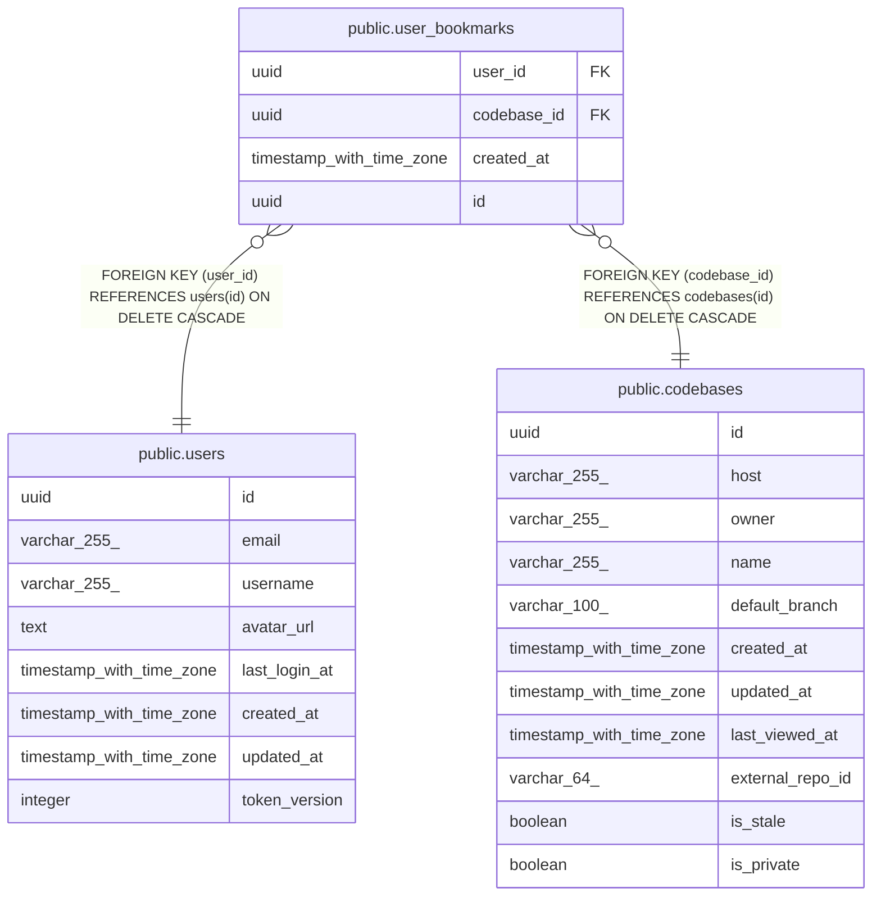

# public.user_bookmarks

## Description

## Columns

| Name        | Type                     | Default           | Nullable | Children | Parents                                 | Comment |
| ----------- | ------------------------ | ----------------- | -------- | -------- | --------------------------------------- | ------- |
| user_id     | uuid                     |                   | false    |          | [public.users](public.users.md)         |         |
| codebase_id | uuid                     |                   | false    |          | [public.codebases](public.codebases.md) |         |
| created_at  | timestamp with time zone | now()             | false    |          |                                         |         |
| id          | uuid                     | gen_random_uuid() | false    |          |                                         |         |

## Constraints

| Name                            | Type        | Definition                                                           |
| ------------------------------- | ----------- | -------------------------------------------------------------------- |
| fk_user_bookmarks_codebase      | FOREIGN KEY | FOREIGN KEY (codebase_id) REFERENCES codebases(id) ON DELETE CASCADE |
| fk_user_bookmarks_user          | FOREIGN KEY | FOREIGN KEY (user_id) REFERENCES users(id) ON DELETE CASCADE         |
| user_bookmarks_pkey             | PRIMARY KEY | PRIMARY KEY (id)                                                     |
| uq_user_bookmarks_user_codebase | UNIQUE      | UNIQUE (user_id, codebase_id)                                        |

## Indexes

| Name                            | Definition                                                                                                      |
| ------------------------------- | --------------------------------------------------------------------------------------------------------------- |
| idx_user_bookmarks_user         | CREATE INDEX idx_user_bookmarks_user ON public.user_bookmarks USING btree (user_id, created_at)                 |
| user_bookmarks_pkey             | CREATE UNIQUE INDEX user_bookmarks_pkey ON public.user_bookmarks USING btree (id)                               |
| uq_user_bookmarks_user_codebase | CREATE UNIQUE INDEX uq_user_bookmarks_user_codebase ON public.user_bookmarks USING btree (user_id, codebase_id) |

## Relations

---

> Generated by [tbls](https://github.com/k1LoW/tbls)
