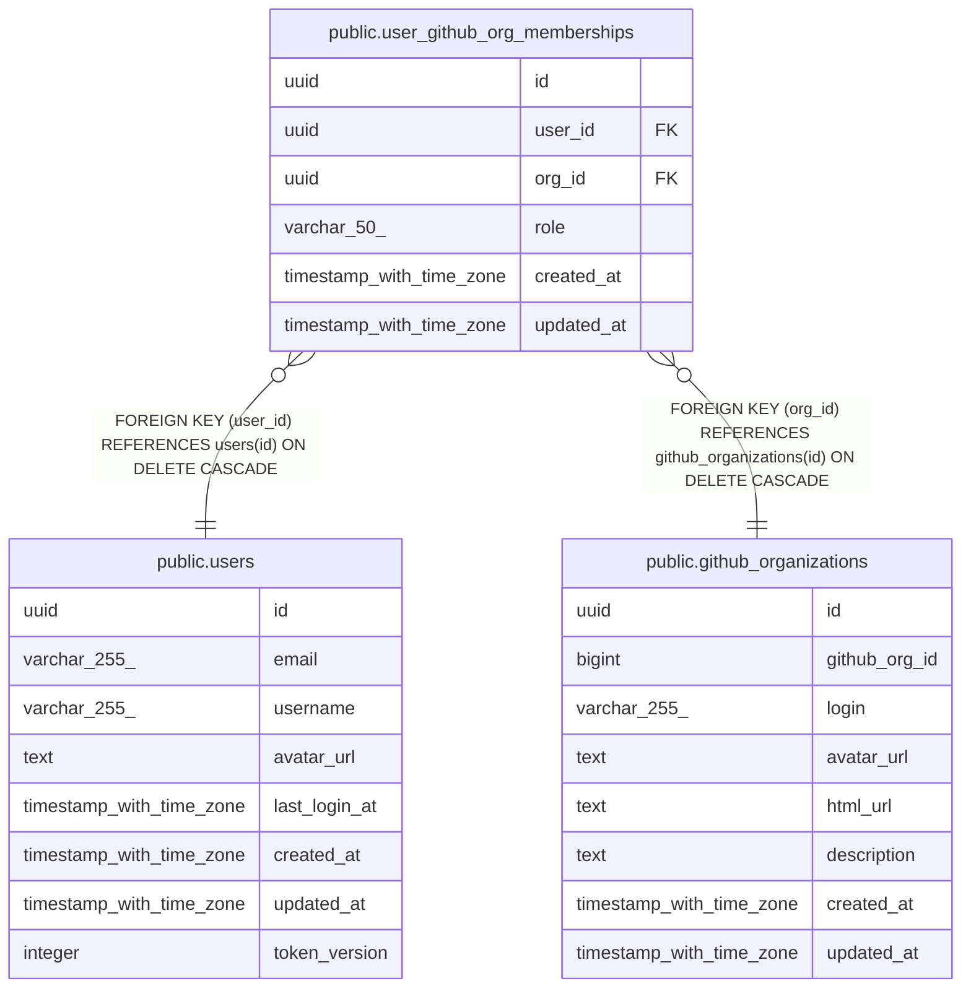

# public.user_github_org_memberships

## Description

## Columns

| Name       | Type                     | Default           | Nullable | Children | Parents                                                       | Comment |
| ---------- | ------------------------ | ----------------- | -------- | -------- | ------------------------------------------------------------- | ------- |
| id         | uuid                     | gen_random_uuid() | false    |          |                                                               |         |
| user_id    | uuid                     |                   | false    |          | [public.users](public.users.md)                               |         |
| org_id     | uuid                     |                   | false    |          | [public.github_organizations](public.github_organizations.md) |         |
| role       | varchar(50)              |                   | true     |          |                                                               |         |
| created_at | timestamp with time zone | now()             | false    |          |                                                               |         |
| updated_at | timestamp with time zone | now()             | false    |          |                                                               |         |

## Constraints

| Name                                    | Type        | Definition                                                                 |
| --------------------------------------- | ----------- | -------------------------------------------------------------------------- |
| fk_user_github_org_memberships_user     | FOREIGN KEY | FOREIGN KEY (user_id) REFERENCES users(id) ON DELETE CASCADE               |
| fk_user_github_org_memberships_org      | FOREIGN KEY | FOREIGN KEY (org_id) REFERENCES github_organizations(id) ON DELETE CASCADE |
| user_github_org_memberships_pkey        | PRIMARY KEY | PRIMARY KEY (id)                                                           |
| uq_user_github_org_memberships_user_org | UNIQUE      | UNIQUE (user_id, org_id)                                                   |

## Indexes

| Name                                    | Definition                                                                                                                      |
| --------------------------------------- | ------------------------------------------------------------------------------------------------------------------------------- |
| user_github_org_memberships_pkey        | CREATE UNIQUE INDEX user_github_org_memberships_pkey ON public.user_github_org_memberships USING btree (id)                     |
| uq_user_github_org_memberships_user_org | CREATE UNIQUE INDEX uq_user_github_org_memberships_user_org ON public.user_github_org_memberships USING btree (user_id, org_id) |
| idx_user_github_org_memberships_org     | CREATE INDEX idx_user_github_org_memberships_org ON public.user_github_org_memberships USING btree (org_id)                     |
| idx_user_github_org_memberships_user    | CREATE INDEX idx_user_github_org_memberships_user ON public.user_github_org_memberships USING btree (user_id)                   |

## Relations

---

> Generated by [tbls](https://github.com/k1LoW/tbls)
