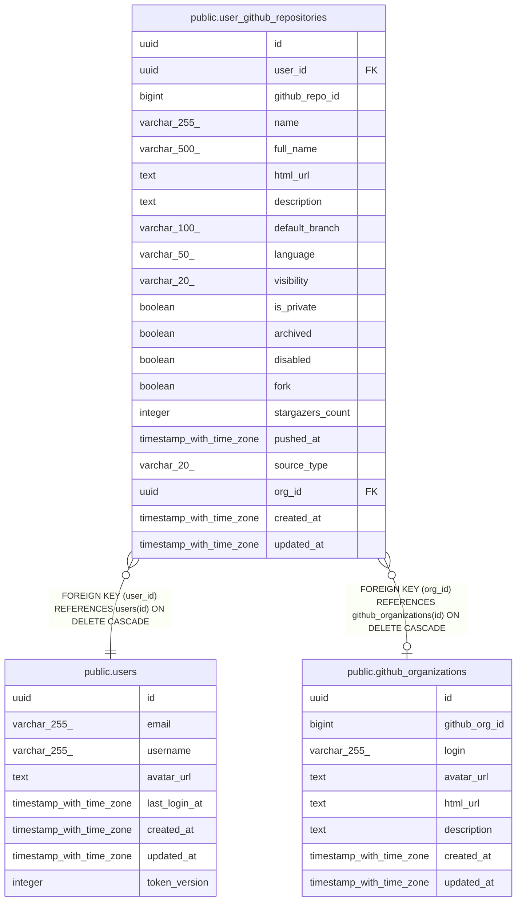

# public.user_github_repositories

## Description

## Columns

| Name             | Type                     | Default                       | Nullable | Children | Parents                                                       | Comment |
| ---------------- | ------------------------ | ----------------------------- | -------- | -------- | ------------------------------------------------------------- | ------- |
| id               | uuid                     | gen_random_uuid()             | false    |          |                                                               |         |
| user_id          | uuid                     |                               | false    |          | [public.users](public.users.md)                               |         |
| github_repo_id   | bigint                   |                               | false    |          |                                                               |         |
| name             | varchar(255)             |                               | false    |          |                                                               |         |
| full_name        | varchar(500)             |                               | false    |          |                                                               |         |
| html_url         | text                     |                               | false    |          |                                                               |         |
| description      | text                     |                               | true     |          |                                                               |         |
| default_branch   | varchar(100)             |                               | true     |          |                                                               |         |
| language         | varchar(50)              |                               | true     |          |                                                               |         |
| visibility       | varchar(20)              | 'public'::character varying   | false    |          |                                                               |         |
| is_private       | boolean                  | false                         | false    |          |                                                               |         |
| archived         | boolean                  | false                         | false    |          |                                                               |         |
| disabled         | boolean                  | false                         | false    |          |                                                               |         |
| fork             | boolean                  | false                         | false    |          |                                                               |         |
| stargazers_count | integer                  | 0                             | false    |          |                                                               |         |
| pushed_at        | timestamp with time zone |                               | true     |          |                                                               |         |
| source_type      | varchar(20)              | 'personal'::character varying | false    |          |                                                               |         |
| org_id           | uuid                     |                               | true     |          | [public.github_organizations](public.github_organizations.md) |         |
| created_at       | timestamp with time zone | now()                         | false    |          |                                                               |         |
| updated_at       | timestamp with time zone | now()                         | false    |          |                                                               |         |

## Constraints

| Name                                  | Type        | Definition                                                                 |
| ------------------------------------- | ----------- | -------------------------------------------------------------------------- |
| fk_user_github_repositories_user      | FOREIGN KEY | FOREIGN KEY (user_id) REFERENCES users(id) ON DELETE CASCADE               |
| fk_user_github_repositories_org       | FOREIGN KEY | FOREIGN KEY (org_id) REFERENCES github_organizations(id) ON DELETE CASCADE |
| user_github_repositories_pkey         | PRIMARY KEY | PRIMARY KEY (id)                                                           |
| uq_user_github_repositories_user_repo | UNIQUE      | UNIQUE (user_id, github_repo_id)                                           |

## Indexes

| Name                                  | Definition                                                                                                                                         |
| ------------------------------------- | -------------------------------------------------------------------------------------------------------------------------------------------------- |
| user_github_repositories_pkey         | CREATE UNIQUE INDEX user_github_repositories_pkey ON public.user_github_repositories USING btree (id)                                              |
| uq_user_github_repositories_user_repo | CREATE UNIQUE INDEX uq_user_github_repositories_user_repo ON public.user_github_repositories USING btree (user_id, github_repo_id)                 |
| idx_user_github_repositories_language | CREATE INDEX idx_user_github_repositories_language ON public.user_github_repositories USING btree (user_id, language) WHERE (language IS NOT NULL) |
| idx_user_github_repositories_org      | CREATE INDEX idx_user_github_repositories_org ON public.user_github_repositories USING btree (user_id, org_id) WHERE (org_id IS NOT NULL)          |
| idx_user_github_repositories_source   | CREATE INDEX idx_user_github_repositories_source ON public.user_github_repositories USING btree (user_id, source_type)                             |
| idx_user_github_repositories_user     | CREATE INDEX idx_user_github_repositories_user ON public.user_github_repositories USING btree (user_id, updated_at)                                |

## Relations

---

> Generated by [tbls](https://github.com/k1LoW/tbls)
