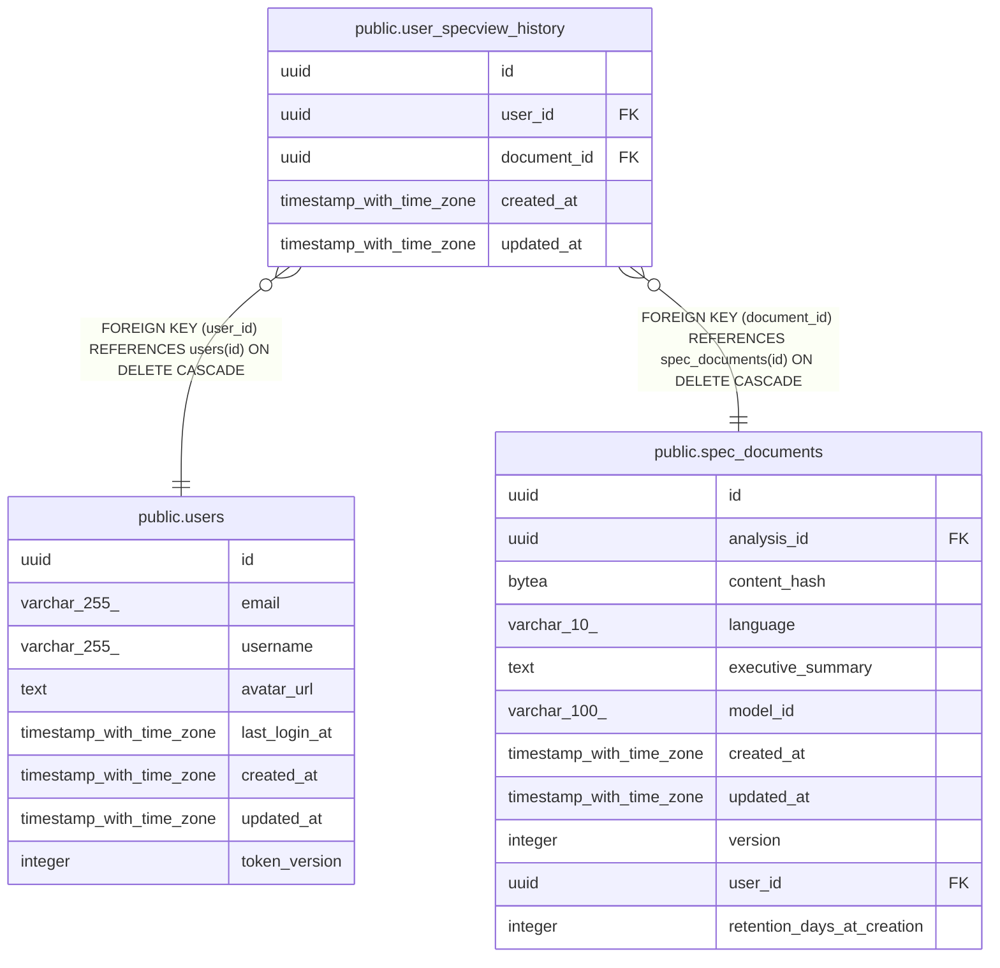

# public.user_specview_history

## Description

## Columns

| Name        | Type                     | Default           | Nullable | Children | Parents                                           | Comment |
| ----------- | ------------------------ | ----------------- | -------- | -------- | ------------------------------------------------- | ------- |
| id          | uuid                     | gen_random_uuid() | false    |          |                                                   |         |
| user_id     | uuid                     |                   | false    |          | [public.users](public.users.md)                   |         |
| document_id | uuid                     |                   | false    |          | [public.spec_documents](public.spec_documents.md) |         |
| created_at  | timestamp with time zone | now()             | false    |          |                                                   |         |
| updated_at  | timestamp with time zone | now()             | false    |          |                                                   |         |

## Constraints

| Name                                   | Type        | Definition                                                                |
| -------------------------------------- | ----------- | ------------------------------------------------------------------------- |
| fk_user_specview_history_user          | FOREIGN KEY | FOREIGN KEY (user_id) REFERENCES users(id) ON DELETE CASCADE              |
| fk_user_specview_history_document      | FOREIGN KEY | FOREIGN KEY (document_id) REFERENCES spec_documents(id) ON DELETE CASCADE |
| user_specview_history_pkey             | PRIMARY KEY | PRIMARY KEY (id)                                                          |
| uq_user_specview_history_user_document | UNIQUE      | UNIQUE (user_id, document_id)                                             |

## Indexes

| Name                                   | Definition                                                                                                                    |
| -------------------------------------- | ----------------------------------------------------------------------------------------------------------------------------- |
| user_specview_history_pkey             | CREATE UNIQUE INDEX user_specview_history_pkey ON public.user_specview_history USING btree (id)                               |
| uq_user_specview_history_user_document | CREATE UNIQUE INDEX uq_user_specview_history_user_document ON public.user_specview_history USING btree (user_id, document_id) |
| idx_user_specview_history_cursor       | CREATE INDEX idx_user_specview_history_cursor ON public.user_specview_history USING btree (user_id, updated_at, id)           |
| idx_user_specview_history_document     | CREATE INDEX idx_user_specview_history_document ON public.user_specview_history USING btree (document_id)                     |

## Relations

---

> Generated by [tbls](https://github.com/k1LoW/tbls)
