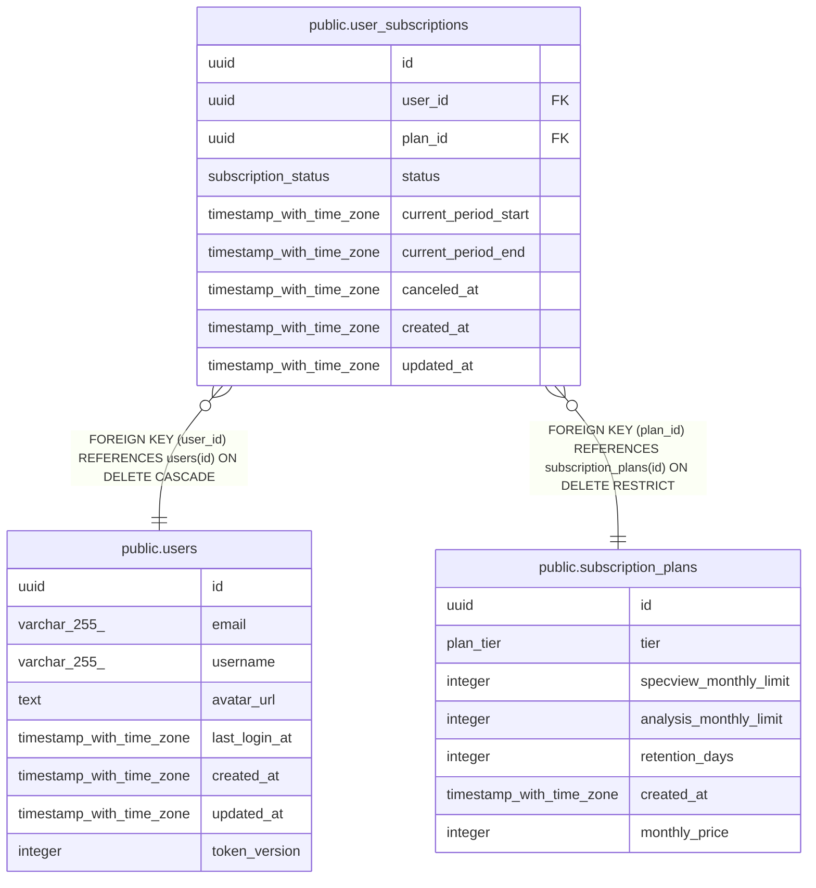

# public.user_subscriptions

## Description

## Columns

| Name                 | Type                     | Default                       | Nullable | Children | Parents                                                   | Comment |
| -------------------- | ------------------------ | ----------------------------- | -------- | -------- | --------------------------------------------------------- | ------- |
| id                   | uuid                     | gen_random_uuid()             | false    |          |                                                           |         |
| user_id              | uuid                     |                               | false    |          | [public.users](public.users.md)                           |         |
| plan_id              | uuid                     |                               | false    |          | [public.subscription_plans](public.subscription_plans.md) |         |
| status               | subscription_status      | 'active'::subscription_status | false    |          |                                                           |         |
| current_period_start | timestamp with time zone |                               | false    |          |                                                           |         |
| current_period_end   | timestamp with time zone |                               | false    |          |                                                           |         |
| canceled_at          | timestamp with time zone |                               | true     |          |                                                           |         |
| created_at           | timestamp with time zone | now()                         | false    |          |                                                           |         |
| updated_at           | timestamp with time zone | now()                         | false    |          |                                                           |         |

## Constraints

| Name                       | Type        | Definition                                                                       |
| -------------------------- | ----------- | -------------------------------------------------------------------------------- |
| chk_canceled_at_status     | CHECK       | CHECK (((status = 'canceled'::subscription_status) = (canceled_at IS NOT NULL))) |
| fk_user_subscriptions_user | FOREIGN KEY | FOREIGN KEY (user_id) REFERENCES users(id) ON DELETE CASCADE                     |
| fk_user_subscriptions_plan | FOREIGN KEY | FOREIGN KEY (plan_id) REFERENCES subscription_plans(id) ON DELETE RESTRICT       |
| user_subscriptions_pkey    | PRIMARY KEY | PRIMARY KEY (id)                                                                 |

## Indexes

| Name                              | Definition                                                                                                                                                  |
| --------------------------------- | ----------------------------------------------------------------------------------------------------------------------------------------------------------- |
| user_subscriptions_pkey           | CREATE UNIQUE INDEX user_subscriptions_pkey ON public.user_subscriptions USING btree (id)                                                                   |
| idx_user_subscriptions_active     | CREATE UNIQUE INDEX idx_user_subscriptions_active ON public.user_subscriptions USING btree (user_id) WHERE (status = 'active'::subscription_status)         |
| idx_user_subscriptions_period_end | CREATE INDEX idx_user_subscriptions_period_end ON public.user_subscriptions USING btree (current_period_end) WHERE (status = 'active'::subscription_status) |
| idx_user_subscriptions_plan       | CREATE INDEX idx_user_subscriptions_plan ON public.user_subscriptions USING btree (plan_id)                                                                 |

## Relations

---

> Generated by [tbls](https://github.com/k1LoW/tbls)
