# public.users

## Description

## Columns

| Name          | Type                     | Default           | Nullable | Children                                                                                                                                                                                                                                                                                                                                                                                                                                                                                                                                                                                                              | Parents | Comment |
| ------------- | ------------------------ | ----------------- | -------- | --------------------------------------------------------------------------------------------------------------------------------------------------------------------------------------------------------------------------------------------------------------------------------------------------------------------------------------------------------------------------------------------------------------------------------------------------------------------------------------------------------------------------------------------------------------------------------------------------------------------- | ------- | ------- |
| id            | uuid                     | gen_random_uuid() | false    | [public.oauth_accounts](public.oauth_accounts.md) [public.user_bookmarks](public.user_bookmarks.md) [public.user_analysis_history](public.user_analysis_history.md) [public.user_github_org_memberships](public.user_github_org_memberships.md) [public.user_github_repositories](public.user_github_repositories.md) [public.github_app_installations](public.github_app_installations.md) [public.refresh_tokens](public.refresh_tokens.md) [public.user_specview_history](public.user_specview_history.md) [public.usage_events](public.usage_events.md) [public.user_subscriptions](public.user_subscriptions.md) |         |         |
| email         | varchar(255)             |                   | true     |                                                                                                                                                                                                                                                                                                                                                                                                                                                                                                                                                                                                                       |         |         |
| username      | varchar(255)             |                   | false    |                                                                                                                                                                                                                                                                                                                                                                                                                                                                                                                                                                                                                       |         |         |
| avatar_url    | text                     |                   | true     |                                                                                                                                                                                                                                                                                                                                                                                                                                                                                                                                                                                                                       |         |         |
| last_login_at | timestamp with time zone |                   | true     |                                                                                                                                                                                                                                                                                                                                                                                                                                                                                                                                                                                                                       |         |         |
| created_at    | timestamp with time zone | now()             | false    |                                                                                                                                                                                                                                                                                                                                                                                                                                                                                                                                                                                                                       |         |         |
| updated_at    | timestamp with time zone | now()             | false    |                                                                                                                                                                                                                                                                                                                                                                                                                                                                                                                                                                                                                       |         |         |
| token_version | integer                  | 1                 | false    |                                                                                                                                                                                                                                                                                                                                                                                                                                                                                                                                                                                                                       |         |         |

## Constraints

| Name       | Type        | Definition       |
| ---------- | ----------- | ---------------- |
| users_pkey | PRIMARY KEY | PRIMARY KEY (id) |

## Indexes

| Name               | Definition                                                                                        |
| ------------------ | ------------------------------------------------------------------------------------------------- |
| users_pkey         | CREATE UNIQUE INDEX users_pkey ON public.users USING btree (id)                                   |
| idx_users_email    | CREATE UNIQUE INDEX idx_users_email ON public.users USING btree (email) WHERE (email IS NOT NULL) |
| idx_users_username | CREATE INDEX idx_users_username ON public.users USING btree (username)                            |

## Relations

```mermaid
erDiagram

"public.oauth_accounts" }o--|| "public.users" : "FOREIGN KEY (user_id) REFERENCES users(id) ON DELETE CASCADE"
"public.user_bookmarks" }o--|| "public.users" : "FOREIGN KEY (user_id) REFERENCES users(id) ON DELETE CASCADE"
"public.user_analysis_history" }o--|| "public.users" : "FOREIGN KEY (user_id) REFERENCES users(id) ON DELETE CASCADE"
"public.user_github_org_memberships" }o--|| "public.users" : "FOREIGN KEY (user_id) REFERENCES users(id) ON DELETE CASCADE"
"public.user_github_repositories" }o--|| "public.users" : "FOREIGN KEY (user_id) REFERENCES users(id) ON DELETE CASCADE"
"public.github_app_installations" }o--o| "public.users" : "FOREIGN KEY (installer_user_id) REFERENCES users(id) ON DELETE SET NULL"
"public.refresh_tokens" }o--|| "public.users" : "FOREIGN KEY (user_id) REFERENCES users(id) ON DELETE CASCADE"
"public.user_specview_history" }o--|| "public.users" : "FOREIGN KEY (user_id) REFERENCES users(id) ON DELETE CASCADE"
"public.usage_events" }o--|| "public.users" : "FOREIGN KEY (user_id) REFERENCES users(id) ON DELETE CASCADE"
"public.user_subscriptions" }o--|| "public.users" : "FOREIGN KEY (user_id) REFERENCES users(id) ON DELETE CASCADE"

"public.users" {
  uuid id
  varchar_255_ email
  varchar_255_ username
  text avatar_url
  timestamp_with_time_zone last_login_at
  timestamp_with_time_zone created_at
  timestamp_with_time_zone updated_at
  integer token_version
}
"public.oauth_accounts" {
  uuid id
  uuid user_id FK
  oauth_provider provider
  varchar_255_ provider_user_id
  varchar_255_ provider_username
  text access_token
  varchar_500_ scope
  timestamp_with_time_zone created_at
  timestamp_with_time_zone updated_at
}
"public.user_bookmarks" {
  uuid user_id FK
  uuid codebase_id FK
  timestamp_with_time_zone created_at
  uuid id
}
"public.user_analysis_history" {
  uuid user_id FK
  uuid analysis_id FK
  timestamp_with_time_zone created_at
  timestamp_with_time_zone updated_at
  uuid id
}
"public.user_github_org_memberships" {
  uuid id
  uuid user_id FK
  uuid org_id FK
  varchar_50_ role
  timestamp_with_time_zone created_at
  timestamp_with_time_zone updated_at
}
"public.user_github_repositories" {
  uuid id
  uuid user_id FK
  bigint github_repo_id
  varchar_255_ name
  varchar_500_ full_name
  text html_url
  text description
  varchar_100_ default_branch
  varchar_50_ language
  varchar_20_ visibility
  boolean is_private
  boolean archived
  boolean disabled
  boolean fork
  integer stargazers_count
  timestamp_with_time_zone pushed_at
  varchar_20_ source_type
  uuid org_id FK
  timestamp_with_time_zone created_at
  timestamp_with_time_zone updated_at
}
"public.github_app_installations" {
  uuid id
  bigint installation_id
  github_account_type account_type
  bigint account_id
  varchar_255_ account_login
  text account_avatar_url
  uuid installer_user_id FK
  timestamp_with_time_zone suspended_at
  timestamp_with_time_zone created_at
  timestamp_with_time_zone updated_at
}
"public.refresh_tokens" {
  uuid id
  uuid user_id FK
  text token_hash
  uuid family_id
  timestamp_with_time_zone expires_at
  timestamp_with_time_zone created_at
  timestamp_with_time_zone revoked_at
  uuid replaces FK
}
"public.user_specview_history" {
  uuid id
  uuid user_id FK
  uuid document_id FK
  timestamp_with_time_zone created_at
  timestamp_with_time_zone updated_at
}
"public.usage_events" {
  uuid id
  uuid user_id FK
  usage_event_type event_type
  uuid analysis_id FK
  uuid document_id FK
  integer quota_amount
  timestamp_with_time_zone created_at
}
"public.user_subscriptions" {
  uuid id
  uuid user_id FK
  uuid plan_id FK
  subscription_status status
  timestamp_with_time_zone current_period_start
  timestamp_with_time_zone current_period_end
  timestamp_with_time_zone canceled_at
  timestamp_with_time_zone created_at
  timestamp_with_time_zone updated_at
}
```

---

> Generated by [tbls](https://github.com/k1LoW/tbls)
